# ionic4教程

## 一、Ionic 介绍以及Ionic 环境搭建

### 1、Ionic 介绍以及Ionic Packages

Ionic 是一个开源的移动应用程序开发框架，它可以轻松地使用web 技术构建高质量的跨平
台的移动应用。可以让我们快速开发移动App、移动端WEB 页面、微信公众平台应用，混
合app web 页面等。
Ionic 基于Web Components，具有更好的运行速度，相比以前版本的Ionic 框架性能提升很
多。
Web Components 是一套不同的技术，允许您创建可重用的定制元素（它们的功能封装在您
的代码之外）并且在您的web 应用中使用它们。目前WEB 组件目前仍然依靠各种类似”
Hack”的方式来模拟，模拟方式也各有不同，很难统一和标准化，而Web Components 则
直接提供了标准化的组件定义方式，这是组件标准化的基石，使得未来的组件能够统一创建、
方法调用、事件监听、属性访问等。基于标准化的组件定义方式，我们便可以像W3C 等标
准组织一样来定义组件标准，无需再依赖、等待“内置”组件，这也使得我们获得了“渔”
的能力。

更多Web Components 知识：http://bbs.itying.com/topic/5c2352cfd5488a17e894a7f4

### 2、ionic Packages

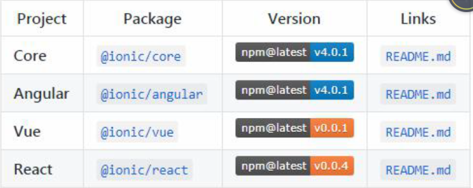

Ionic = Cordova + Angular + ionic CSS
Ionic=Cordova + React+ ionic CSS
Ionic=Cordova + Vue+ ionic CSS
Ionic4.x 以后在Angular、Vue、React 基础上面做了一些封装，让我们可以更快速和容易的
开发移动的项目。Ionic 调用原生的功能是基于Cordova , Cordova 提供了使用JavaScript 调
用Native 功能，Ionic 自己也封装了一套漂亮的CSS UI 库。

### 3.、Ionic 的安装运行

#### ①.学习前准备工作

1、必须得安装nodejs (建议安装最新的稳定版本)
2、必须有Angular 基础：https://www.itying.com/goods-1047.html

#### ②安装cordova ionic

```
npm install -g cordova ionic
```

#### ③创建项目:

```
ionic start myApp tabs
```

  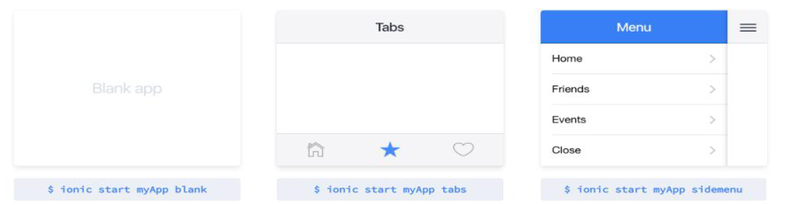                                                                                                                                                                   

#### ④运行项目                                                                                                                                                                                         

cd到刚才创建的项目，ionic serve运行项目

### 4.Ionic 有时候安装失败怎么办

1、检查自己的nodejs 版本(建议使用最新稳定版本)

2、安装cnpm

```
npm install -g cnpm --registry=https://registry.npm.taobao.org
```

以后所有的npm 可用cnpm 代替cnpm install -g cordova ionic

3、nrm 管理npm 源

如果cnpm 创建的项目有问题，我们可以重新用npm，这个时候可以用nrm 来管理npm 的源。

## 二、Ionic 目录结构分析、核心文件分析、执行流程

### 1.Ionic4.x 目录结构分析

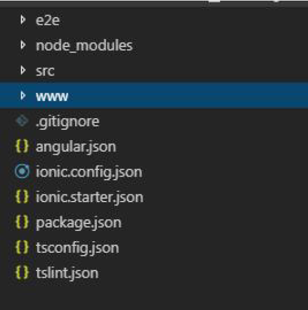

e2e：端对端测试文件
node_modules ：项目所需要的依赖包                                                                                                             resources ：android/ios 资源（更换图标和启动动画）
src：开发工作目录，页面、样式、脚本和图片都放在这个目录下
www：静态文件，ionic build --prod 生成的单页面静态资源文件
platforms：生成android 或者ios 安装包需要的资源---(cordova platform add android 后会生成)
plugins：插件文件夹，里面放置各种cordova 安装的插件
config.xml: 打包成app 的配置文件
package.json: 配置项目的元数据和管理项目所需要的依赖
ionic.config.json、ionic.starter.json：ionic 配置文件
angular.json angular 配置文件
tsconfig.json: TypeScript 项目的根目录，指定用来编译这个项目的根文件和编译选项
tslint.json：格式化和校验typescript

### 2.Ionic4.x src 下面文件分析

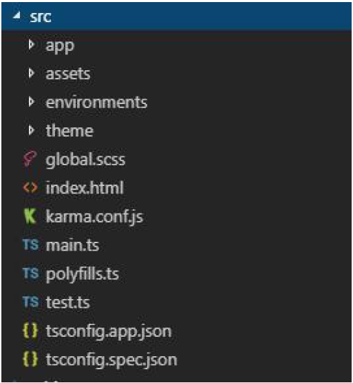

app：应用根目录（组件、页面、服务、模块...）
assets：资源目录（静态文件（图片，js 框架...）
theme：主题文件，里面有一个scss 文件，设置主题信息。
global.scss：全局css 文件                                                                                                                              index.html：index 入口文件
main.ts：主入口文件
karma.conf.js/test.js：测试相关的配置文件
polyfills.ts: 这个文件包含Angular 需要的填充，并在应用程序之前加载

app 下面文件分析

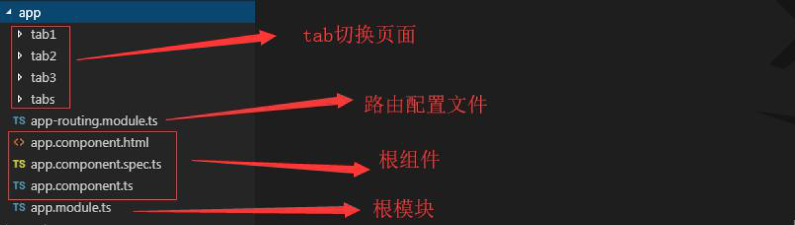

app.module.ts 分析

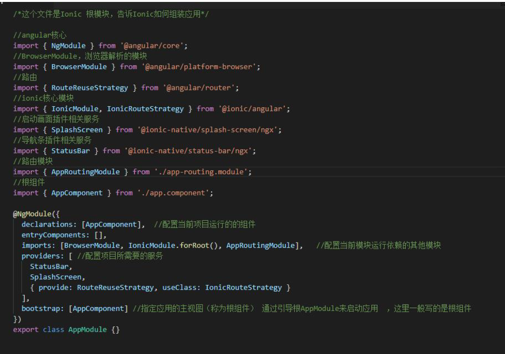

app-routing.module.ts 分析

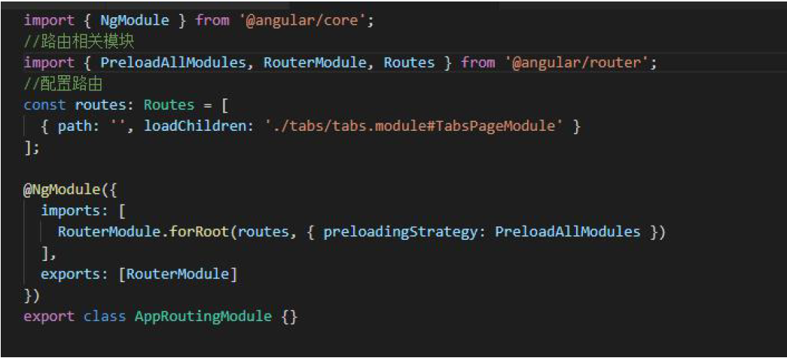

路由匹配以及项目执行流程:略

https://github.com/hufanglei/angular-it-demo.git

## 三、创建页面以及页面跳转、Ionic4.x新增tabs 页面、Ionic4.x 自定义公共模块、数据渲染等

### 1.Ionic4.x 创建页面以及页面跳转

Ionic4.x 中创建页面和ionic3 中是一样的，下面我们一步一步给大家看看在ionic4.x 中如何创建页面以及进行页面跳转

1、cd 到我们的项目目录

2、通过ionic g page 页面名称如下图所示

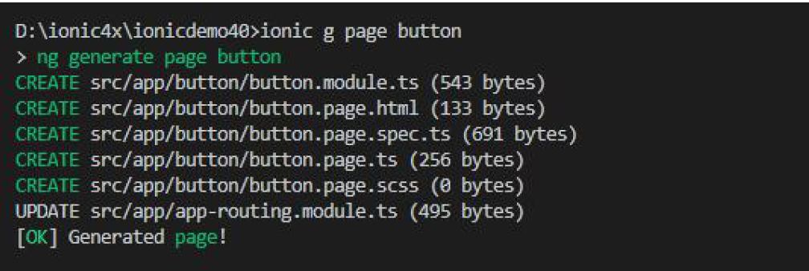

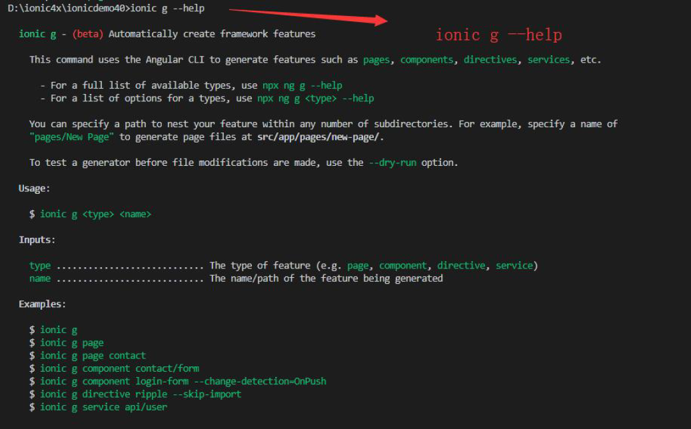

3、创建完成组件以后会在src 目录下面多一个button 的目录，它既是一个页面也是一个模块

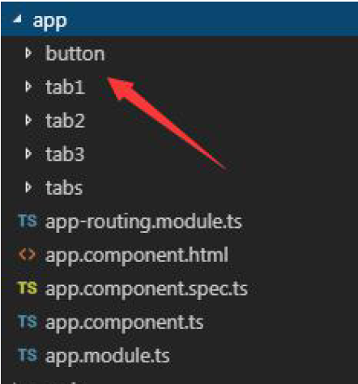

4、如果我们想在tab1 里面写一个按钮点击跳转到button 页面的话我们可以通过使用Angular 的路由跳转。在ionic4.x 中路由是完全基于angular，用法几乎和angular 一样。

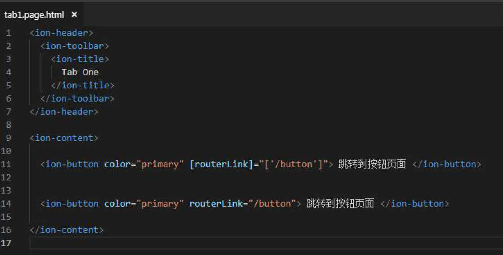

5、ionic4.x 中跳转到其他页面不会默认加返回按钮，如果我们想给button 页面加返回的话需要找到button 对应的button.page.html，然后在再头部加入ion-back-button。如下图

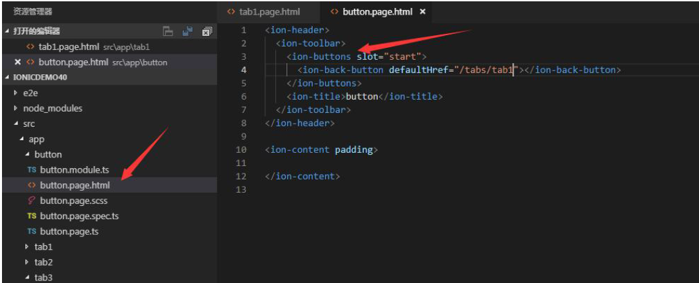

### 2.Ionic4.x 新增底部tabs 页面

1、创建tab4 模块      

```
ionic g page tab4
```

2、修改根目录里app-routing.module.ts 文件里面的路由配置，去掉默认增加的路由

3、tabs.router.module.ts 中新增路由

```typescript
{
	path: 'tab4', loadChildren: '../tab4/tab4.module#Tab4PageModule'
}
```

4、tabs.page.html 中新增底部tab 切换按钮

```html
<ion-tabs>
 	<ion-tab-bar slot="bottom">
    	<ion-tab-button tab="tab1">
			<ion-icon name="flash"></ion-icon>
		     <ion-label>Tab One</ion-label>
         </ion-tab-button>
     <ion-tab-button tab="tab2">
         <ion-icon name="apps"></ion-icon>
         <ion-label>Tab Two</ion-label>
       </ion-tab-button>
     <ion-tab-button tab="tab3">
          <ion-icon name="send"></ion-icon>
          <ion-label>Tab Three</ion-label>
     </ion-tab-button>
     <ion-tab-button tab="tab4">
          <ion-icon name="settings"></ion-icon>
          <ion-label>Tab four</ion-label>
       </ion-tab-button>
    </ion-tab-bar>
</ion-tabs>
```

### 3.Ionic4.x 中自定义公共模块

#### 1、创建公共模块以及组件

```
ionic g module module/slide
ionic g component module/slide
```

#### 2、公共模块slide.module.ts 中暴露对应的组件

```typescript
import { NgModule } from '@angular/core';
import { CommonModule } from '@angular/common';
import { SlideComponent } from './slide.component';
@NgModule({
declarations: [SlideComponent],
imports: [
CommonModule
],
exports:[SlideComponent]
})
export class SlideModule { }
```

#### 3.用到的地方引入自定义模块，并依赖注入自定义模块

```typescript
import { SlideModule } from '../module/slide/slide.module';
@NgModule({
imports: [
CommonModule,
FormsModule,
IonicModule,
SlideModule,
RouterModule.forChild(routes)
],
declarations: [Tab4Page]
})
```

#### 4、使用自定义模块

```
<app-slide></app-slide>
```

### 4.Ionic4.x 自定义公共模块中使用ionic 内置组件

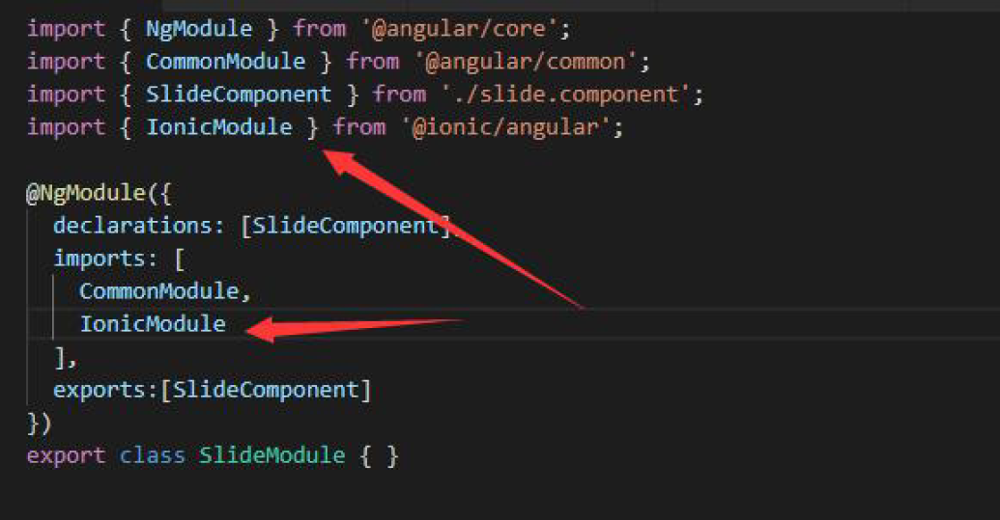

源码:

<https://github.com/hufanglei/angular-it-demo/tree/ionic4-03>

思考：

### ***5.page和module的区别?***

module是个空壳

page=module+加个默认的module+page+路由

使用上:

page一般创建的时候直接生成在根组件上的路由上，根据路由找到指定的page，对外暴露url

module需要手动在其他module上导入，在页面中使用module里面的组件，不对外暴露url

## 四、Ionic4.x 中的UI 组件

### 1.Ionic4.x 内置颜色

primary secondary tertiary success warning danger dark medium light

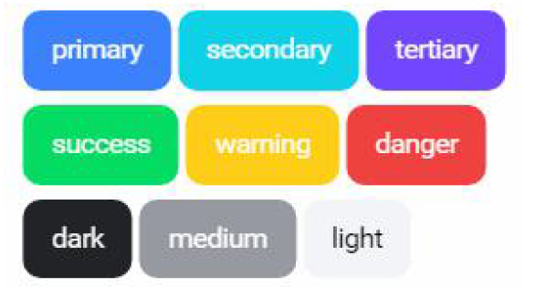

```html
<ion-button color="primary"> primary </ion-button>
<ion-button color="secondary"> secondary </ion-button>
```

### 2.Ionic4.x 中的按钮

官方文档：https://ionicframework.com/docs/api/button

#### 1、ion-button 组件可以定义一个按钮

```html
<ion-button>Default</ion-button>
```

#### 2、color 属性定义按钮的颜色

```html
<ion-button color="primary"> primary </ion-button>
<ion-button color="secondary"> secondary </ion-button>
<ion-button color="tertiary"> tertiary </ion-button>
<ion-button color="success"> success </ion-button>
<ion-button color="warning"> warning </ion-button>
<ion-button color="danger"> danger </ion-button>
<ion-button color="dark"> dark </ion-button>
<ion-button color="medium"> medium </ion-button>
<ion-button color="light"> light </ion-button>
```

#### 3.expand 设置按钮的宽度

此属性允许您指定按钮的宽度。默认情况下，按钮是内联块，但是设置此属性将按钮更改为全宽度块元素。

```html
<ion-button color="primary" expand="block"> button </ion-button>
<ion-button color="primary" expand="full"> button </ion-button>
```

#### 4.fill 设置背景填充

此属性决定按钮的背景和边框颜色。默认情况下，按钮有一个固定的背景，除非按钮位于工具栏内部，如果按钮在工具栏顶部默认情况下面按钮有一个透明的背景。

| clear   | 具有类似于扁平按钮的透明背景的按钮。   |
| ------- | -------------------------------------- |
| outline | 具有透明背景和可见边框的按钮。         |
| solid   | 按钮具有填充的背景。用于工具栏中的按钮 |

```html
<ion-button expand="full" fill="outline">Outline + Full</ion-button>
<ion-button fill="clear" color="success">
<ion-icon slot="icon-only" name="add"></ion-icon>
</ion-button>
<ion-button fill="solid" (click)="goBack()">
<ion-icon name="ios-arrow-back" slot="start"></ion-icon>
	返回
</ion-button>
```

#### 5.size 设置按钮的大小

| small   | 小按钮   |
| ------- | -------- |
| default | 默认按钮 |
| large   | 大按钮   |

#### 6、mode 决定使用哪种平台样式

```html
<ion-button mode='ios' color="primary"> ios 平台的按钮</ion-button>
<ion-button mode='md' color="primary">android 平台的按钮</ion-button>
```

#### 7、按钮结合图标

```html
<ion-button>
<ion-icon slot="start" name="star"></ion-icon>
	Left Icon
</ion-button>
<ion-button>
	Right Icon
<ion-icon slot="end" name="star"></ion-icon>
</ion-button>	
```


### 3、ionic 中的图标

ionic 图标官网：https://ionicons.com/
name 指定图标的名称

```html
<ion-icon name="arrow-dropright-circle"></ion-icon>
```

slot 指定图标的位置:

```html
<ion-button>
	<ion-icon slot="start" name="star"></ion-icon>
		Left Icon
	</ion-button>
<ion-button>
    Right Icon
<ion-icon slot="end" name="star"></ion-icon>
</ion-button>
<ion-button fill="clear" color="success">
<ion-icon slot="icon-only" name="add"></ion-icon>
</ion-button>
```

### 4、ion-header 、ion-footer 、ion-content 、ion-toolbar 、ion-title 、ion-buttons 、ion-back-button

官方文档：https://ionicframework.com/docs/api/toolbar
ion-header 头部，ion-content 内容，ion-footer 底部
ion-toolbar 主要用于头部和底部，固定在页面顶部或者底部。
ion-title 放在ion-toolbar 里面指定导航的名称
ion-buttons 按钮组，主要用在ion-toolbar 中，工具栏中的按钮应该放在ion-buttons 的内部。
ion-back-button 返回按钮，放在ion-buttons 里面
ion-buttons 里面的属性：

| secondary | 元素在ios 模式下位于内容左侧，在md 模式下直接位于内容右侧。 |
| --------- | ----------------------------------------------------------- |
| primary   | 元素在ios 模式下位于内容右侧，在md 模式下位于最右           |
| start     | 在LTR 中位于内容的左侧，在RTL 中位于内容的右侧。            |
| end       | 在LTR 中位于内容的右侧，在RTL 中位于内容的左侧。            |

用法：

```html
<ion-toolbar>
<ion-title>Title Only</ion-title>
</ion-toolbar>
<ion-toolbar>
<ion-buttons slot="start">
<ion-back-button></ion-back-button>
</ion-buttons>
<ion-title>Back Button</ion-title>
</ion-toolbar>
<ion-toolbar>
<ion-buttons slot="secondary">
<ion-button>
<ion-icon slot="icon-only" name="contact"></ion-icon>
</ion-button>
<ion-button>
<ion-icon slot="icon-only" name="search"></ion-icon>
</ion-button>
</ion-buttons>
<ion-title>Default Buttons</ion-title>
<ion-buttons slot="primary">
<ion-button color="secondary">
<ion-icon slot="icon-only" name="more"></ion-icon>
</ion-button>
</ion-buttons>
</ion-toolbar>
```

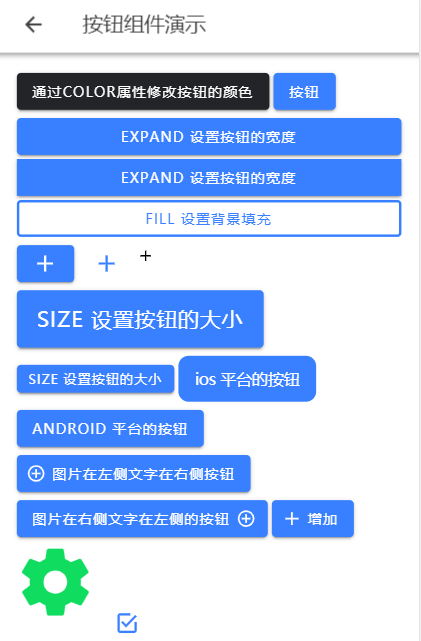

```html
<ion-header>
  <ion-toolbar>
    <ion-buttons slot="start">
      <ion-back-button></ion-back-button>
    </ion-buttons>
    <ion-title>按钮组件演示</ion-title>
  </ion-toolbar>
</ion-header>

<ion-content padding>
    <ion-button color="dark"> 通过color属性修改按钮的颜色 </ion-button>
    <ion-button color="primary"> 按钮 </ion-button>
    <ion-button color="primary" expand="block"> expand 设置按钮的宽度    </ion-button>
    <ion-button color="primary" expand="full"> expand 设置按钮的宽度    </ion-button>
    <ion-button fill="outline" expand="block"> fill 设置背景填充 </ion-button>

   <ion-button>
     <ion-icon slot="icon-only" name="add"></ion-icon>
   </ion-button>

   <ion-button fill="clear">
      <ion-icon slot="icon-only" name="add"></ion-icon>
  </ion-button>

  <ion-icon name="add"></ion-icon>

  <ion-button  size="large">
      size 设置按钮的大小 
  </ion-button>

  <ion-button  size="small">
      size 设置按钮的大小 
  </ion-button>
  <ion-button mode='ios' color="primary"> ios 平台的按钮 </ion-button>    
  <ion-button mode='md' color="primary">android 平台的按钮 </ion-button>

   <ion-button color="primary" href="">
     <ion-icon name="add-circle-outline" slot="start"></ion-icon>
     图片在左侧文字在右侧按钮
   </ion-button>

   <ion-button color="primary" href=""> 
     图片在右侧文字在左侧的按钮
     <ion-icon name="add-circle-outline" slot="end"></ion-icon>
   </ion-button>

   <ion-button color="primary" href="">      
      <ion-icon name="add" slot="start"></ion-icon>
      增加
    </ion-button>
    <ion-icon name="settings" color="success" class="myicon"></ion-icon>

    <ion-button  fill="clear">
       <ion-icon name="checkbox-outline" slot="icon-only"></ion-icon>
    </ion-button>
</ion-content>
```

### 5.导航返回也可以指定返回的地址

使用defaultHref

```html
<ion-header>
  <ion-toolbar>
    <ion-buttons slot="start">
      <!-- <ion-back-button defaultHref="/tabs/tab1" text="返回" icon="add"></ion-back-button> -->
      <ion-back-button defaultHref="/tabs/tab1" text="返回"></ion-back-button> 
    </ion-buttons>
    <ion-title>toolbar导航</ion-title>
  </ion-toolbar>
</ion-header>
```

代码地址:

<https://github.com/hufanglei/angular-it-demo/tree/ionic4-04>

### 6.列表

#### 1、普通列表

```html
<ion-list>
<ion-item>
<ion-label>Peperoni</ion-label>
</ion-item>
<ion-item>
<ion-label>Hawaii</ion-label>
</ion-item>
</ion-list>
```

如果普通列表加上路由跳转的话列表将会自动加上箭头

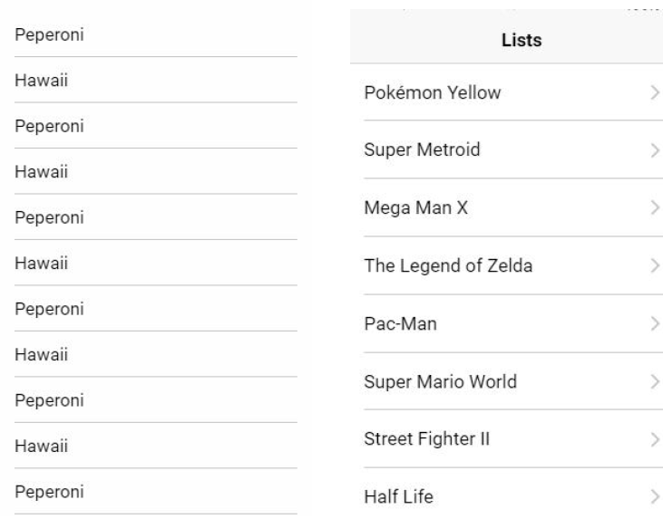

#### 2、分组列表ion-item-divider

```html
<ion-list>
<ion-item-divider>
<ion-label>
Section A
</ion-label>
</ion-item-divider>
<ion-item><ion-label>A1</ion-label></ion-item>
<ion-item><ion-label>A2</ion-label></ion-item>
<ion-item><ion-label>A3</ion-label></ion-item>
<ion-item-divider>
<ion-label>
Section B
</ion-label>
</ion-item-divider>
<ion-item><ion-label>B1</ion-label></ion-item>
<ion-item><ion-label>B2</ion-label></ion-item>
<ion-item><ion-label>B3</ion-label></ion-item>
</ion-list>
```

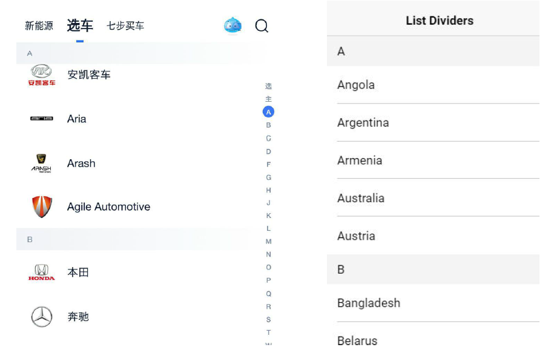

#### 3、列表中带图标

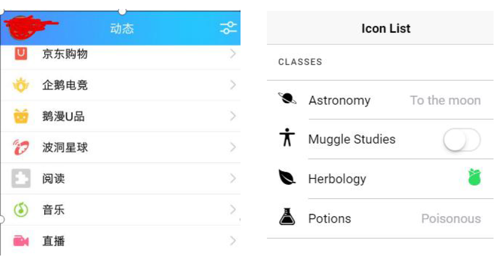

```html
<ion-list>
<ion-item>
<ion-icon slot="start" name="people"></ion-icon>
<ion-label>个人中心</ion-label>
<ion-icon slot="end" name="arrow-forward"></ion-icon>
</ion-item>
<ion-item>
<ion-icon slot="start" name="wallet" color="success"></ion-icon>
<ion-label>钱包</ion-label>
<ion-icon slot="end" name="arrow-forward"></ion-icon>
</ion-item>
</ion-list>
```

#### 4、列表中的头像

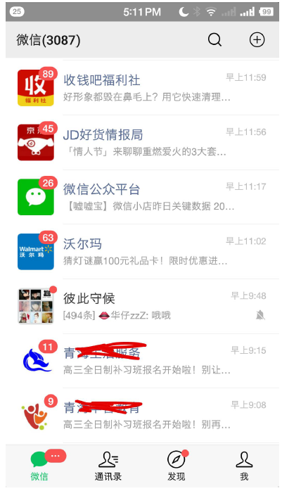

```html
<ion-list>
  <ion-item>
    <ion-avatar>
      
    </ion-avatar>
    <ion-label>沃尔玛无人收银系统</ion-label>
  </ion-item>
  <ion-item>
    <ion-avatar>
      
    </ion-avatar>
    <ion-label>Hawaii</ion-label>
  </ion-item>
  <ion-item>
    <ion-avatar>
      
    </ion-avatar>
    <ion-label>haha </ion-label>
  </ion-item>
</ion-list>
```

#### 5、列表中的图片ion-thumbnail

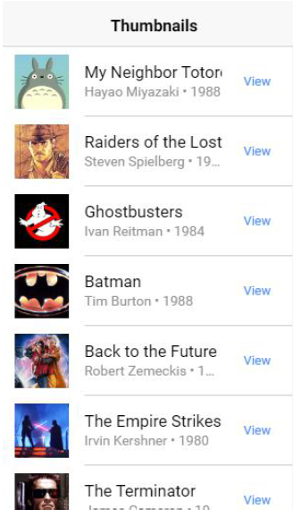

```html
<ion-list>
  <ion-item>
    <ion-thumbnail slot="start">
      
    </ion-thumbnail>
    <ion-label>Peperoni</ion-label>
  </ion-item>
  <ion-item>
    <ion-thumbnail slot="start">
      
    </ion-thumbnail>
    <ion-label>Hawaii</ion-label>
  </ion-item>
  <ion-item>
    <ion-thumbnail slot="end">
      
    </ion-thumbnail>
    <ion-label>Hawaii</ion-label>
  </ion-item>
  <ion-item>
    <ion-thumbnail slot="end">
      
    </ion-thumbnail>
    <ion-label>Hawaii</ion-label>
  </ion-item>
  <ion-item>
    <ion-thumbnail slot="end">
      
    </ion-thumbnail>
    <ion-label>Hawaii</ion-label>
  </ion-item>
</ion-list>
```

#### 6、滑动列表


```html
<ion-list>
  <ion-item-sliding>
    <ion-item>
      <ion-label>Item1</ion-label>
    </ion-item>
    <ion-item-options side="start">
      <ion-item-option (click)="favorite(item)">Favorite</ion-item-option>
      <ion-item-option color="primary" (click)="share(item)">Share</ion-item-option>
    </ion-item-options>
    <ion-item-options side="end">
      <ion-item-option (click)="unread(item)">Unread</ion-item-option>
    </ion-item-options>
  </ion-item-sliding>
  <ion-item-sliding>
    <ion-item>
      <ion-label>Item2</ion-label>
    </ion-item>
    湖北众猿腾网络科技有限公司
    <ion-item-options side="start">
      <ion-item-option color="success">Favorite</ion-item-option>
      <ion-item-option color="primary" (click)="share(item)">Share</ion-item-option>
    </ion-item-options>
    <ion-item-options side="end">
      <ion-item-option color="success">Unread</ion-item-option>
    </ion-item-options>
  </ion-item-sliding>
</ion-list>
```

#### 7.ion-item 的属性

https://ionicframework.com/docs/api/item


#### 8.特别技巧:

ion-list上的 lines="full" 下划线顶格显示

```HTML
<ion-list lines="full">
    <ion-item *ngFor="let item of list" [routerLink]="['/button']">
      <ion-label>{{item}}</ion-label>
    </ion-item>
  </ion-list>
```

代码地址:

<https://github.com/hufanglei/angular-it-demo/tree/ionic4-05>


### 7.表单相关组件

#### 1、ion-input 单行文本框

```html
<ion-list>
    <ion-item>
        <ion-label>用户名:</ion-label>
        <ion-input [(ngModel)]="peopleInfo.username"></ion-input>
    </ion-item>
    <ion-item>
        <ion-label>年龄:</ion-label>
        <ion-input [(ngModel)]="peopleInfo.age"></ion-input>
    </ion-item>
</ion-list>
```

#### 2、ion-toggle 开关

```html
<ion-item>
    <ion-label>是否本科</ion-label>
    <ion-toggle slot="end" [(ngModel)]="peopleInfo.falg"></ion-toggle>
</ion-item>
```

#### 3、ion-radio-group、ion-radio 单选按钮组

```html
<ion-list>
    <ion-radio-group [(ngModel)]="peopleInfo.payType">
        <ion-item>
            <ion-avatar slot="start">
                
            </ion-avatar>
            <ion-label>支付宝</ion-label>
            <ion-radio value='1' slot="end"></ion-radio>
        </ion-item>
        <ion-item>
            <ion-avatar slot="start">
                
            </ion-avatar>
            <ion-label>微信</ion-label>
            <ion-radio value='2' slot="end"></ion-radio>
        </ion-item>
    </ion-radio-group>
</ion-list>
```

#### 4、ion-checkbox 多选按钮组

```html
<ion-list>
    <ion-item *ngFor="let item of peopleInfo.checkBoxList">
        <ion-label>{{item.val}}</ion-label>
        <ion-checkbox slot="start" [(ngModel)]="item.isChecked"></ion-checkbox>
    </ion-item>
</ion-list>
```

#### 5、ion-select 选择框

```html
<ion-list>
    <ion-select slot="end" [(ngModel)]="peopleInfo.city">
        <ion-select-option *ngFor="let item of peopleInfo.cityList" [value]="item">{{item}}</ion-select-option>
    </ion-select>
</ion-list>
```

#### 6、ion-textarea 多行文本框

```html
<ion-list>
    <ion-item>
        <ion-textarea [(ngModel)]="peopleInfo.info"></ion-textarea>
    </ion-item>
</ion-list>
```

总结:

输入框是ion-item包裹一个ion-label和一个ion-input

checkbox是遍历一个数组，item包裹一个ion-label和一个ion-checkbox

单选框radio，ion-radio-group上绑定数据，包裹多个ion-item，ion-item再包裹一个ion-babel和一个ion-radio

下拉框是ion-select包裹一个ion-select-option

ion-textarea是简化版本的输入框，直接ion-item包裹一个ion-textarea

### 8.Slides 轮播图组件、Searchbar 组件、Segment 组件

#### 1、Slides 轮播图组件

Ionic4.x 中的轮播图组件是基于swiper 插件，所以配置slides 的属性需要在swiper 的api 中找

Swiper Api：http://idangero.us/swiper/api/

##### 1、配置slides 的属性

```typescript
export class SlidesPage implements OnInit {
    slideOpts = {
        effect: 'flip',
        speed: 400,
        loop:true,
        autoplay: {
            delay: 2000
       }
    };
}
```

##### 2、ion-slide 实现轮播图

```html
<ion-slides pager="true" [options]="slideOpts">
    <ion-slide>
        <h1>Slide 1</h1>
    </ion-slide>
    <ion-slide>
        <h1>Slide 2</h1>
    </ion-slide>
    <ion-slide>
        <h1>Slide 3</h1>
    </ion-slide>
</ion-slides>
```

##### 3、ion-slide 的高级用法，调用方法实现轮播

1、获取slide 对象之第一步，定义名称#slide

```html
<ion-slides pager="true" #slide>
    <ion-slide>
        <h1>Slide 1</h1>
    </ion-slide>
    <ion-slide>
        <h1>Slide 2</h1>
    </ion-slide>
    <ion-slide>
        <h1>Slide 3</h1>
    </ion-slide>
</ion-slides>
```

2、获取slide 对象之第二步，引入ViewChild 获取slide 对象

```typescript
import { Component, OnInit,ViewChild } from '@angular/core';
```

```
@ViewChild('slide') slide;

```

3、触发事件调用slide 的方法

```typescript
doSlide(){
    this.slide.slideNext();
}
```

4.手动滑动后轮播图不自动轮播的解决方法

添加ionSlideTouchEnd事件

```html
<ion-slides pager="true" [options]="slideOpts" #slide1 (ionSlideTouchEnd)="slideDidChange()">
    <ion-slide>
        
    </ion-slide>
    <ion-slide>
        
    </ion-slide>
</ion-slides>
```

```typescript
 //手动滑动后轮播图不自动轮播的解决方法
 slideDidChange(){
     console.log('111');
     this.slide1.startAutoplay();
 }
```


#### 2、Searchbar 搜索组件

主要用于搜索框

https://ionicframework.com/docs/api/searchbar

```html
<ion-searchbar placeholder="Filter Schedules"></ion-searchbar>
<ion-searchbar placeholder="Filter" animated showCancelButton cancelButtonText="取消"></ion-searchbar>
<ion-searchbar placeholder="Filter" animated></ion-searchbar>
<ion-searchbar placeholder="Filter" animated color="primary"></ion-searchbar>
<ion-searchbar debounce="500" (ionChange)="searchBarChange()"></ion-searchbar>
```

#### 3、Segment 自定义tab 切换组件

主要用于页面tab 切换

https://ionicframework.com/docs/api/segment

```html
<ion-segment [(ngModel)]="tabs" (ionChange)="segmentChanged($event)">
    <ion-segment-button value="plist">
        商品列表
    </ion-segment-button>
    <ion-segment-button value="pcontent">
        商品详情
    </ion-segment-button>
</ion-segment>
<div [ngSwitch]="tabs">
    <div class="con1" *ngSwitchCase="'plist'">
        商品图文信息
    </div>
    <div class="con2" *ngSwitchCase="'pcontent'">
        商品详情
    </div>
</div>
```

注意:

ngSwichCase的写法，带引号，把tabs绑定到[ngSwitch]上。

### 9.日期组件

官方文档：https://ionicframework.com/docs/api/datetime

#### 1、日期组件的基本使用

模板中：

```html
<ion-datetime display-format="YYYY-MM-DD" [(ngModel)]="day"></ion-datetime>
<ion-datetime display-format="MM/YYYY" picker-format="MMMM YYYY"></ion-datetime>
```

业务逻辑中,设置初始化日期

```typescript
import sd from 'silly-datetime';
constructor() {
	this.day=sd.format(new Date(), 'YYYY-MM-DD');
}
```

#### 2、自定义日期组件的Options

模板中：

```html
<ion-datetime display-format="YYYY-MM-DD" [pickerOptions]="customPickerOptions" ></ion-datetime>
```

业务逻辑中：

```typescript
public customPickerOptions = {
        buttons: [{
            text: '取消',
            handler: () => console.log('Clicked Save!')
        }, {
            text: '保存',
            handler: () => {
                console.log('Clicked Log. Do not Dismiss.');
            }
        }]
}
```

注意，去掉案例上的 return false。否则时间控件不取消显示。

代码演示:

<https://github.com/hufanglei/angular-it-demo/tree/ionic4-09>

### 10.侧边栏ion-menu 组件以及底部tabs 结合 侧边栏ion-menu

#### 1、侧边栏ion-menu 组件的基本使用

1、创建项目

```
ionic start myApp sidemenu

```

2、配置项目

| 属性          | 作用                 | 可选值                |
| ------------- | -------------------- | --------------------- |
| side          | 配置侧边栏的位置     | start end             |
| menuId        | 侧边栏的唯一标识     |                       |
| type          | 配置侧边栏的弹出方式 | overlay, reveal, push |
| swipe-gesture | 滑动弹出侧边栏       | true false            |

```html
<ion-menu side="start" menuId="first">
    <ion-header>
        <ion-toolbar color="primary">
            <ion-title>Start Menu</ion-title>
        </ion-toolbar>
    </ion-header>
    <ion-content>
        <ion-list>
            <ion-menu-toggle auto-hide="false">
                <ion-item [routerDirection]="'root'" [routerLink]="['/button']"> 这是一个列表</ion-item>
            </ion-menu-toggle>
            <ion-menu-toggle auto-hide="false">
                <ion-item [routerDirection]="'root'" [routerLink]="['/button']"> 这是一个列表</ion-item>
            </ion-menu-toggle>
        </ion-list>
    </ion-content>
</ion-menu>
<ion-router-outlet main></ion-router-outlet>
```

#### 2、侧边栏ion-menu 中的事件和方法

Ionic4.x 中允许我们用js 控制侧边栏，具体步骤如下。

1、给ion-menu 定义menuId 属性

```html
<ion-menu side="start" menuId="first">
</ion-menu>
```

2、控制菜单的页面中引入下面代码：

```typescript
import { MenuController } from '@ionic/angular';
```

3、初始化构造函数

```
constructor(private menu: MenuController) { }

```

4、对应方法中通过js 控制侧边栏

```typescript
doOPenMenu() {
	this.menu.open('first');
}
```

#### 3、ion-menu-toggle

点击后侧边栏消失

#### 4.ion-menu-button

<ion-menu-button menu="end1"中的menu对应app上定义的menuId

```html
<ion-header>
  <ion-toolbar>
    <ion-buttons slot="start">
      <ion-menu-button></ion-menu-button>
    </ion-buttons>
    <ion-title>
      Home
    </ion-title>

    <ion-buttons slot="end">
      <ion-menu-button menu="end1"></ion-menu-button>
    </ion-buttons>
  </ion-toolbar>
</ion-header>
```


#### 5、底部tabs 结合侧边栏ion-menu

找到app.component.html 在页面中加入下面代码

```html
<ion-app>
    <ion-menu swipe-gesture=true type="overlay" menuId="first" >
        <ion-header>
            <ion-toolbar>
                <ion-title>菜单</ion-title>
            </ion-toolbar>
        </ion-header>
        <ion-content>
            <ion-list>
                <ion-menu-toggle auto-hide="false">
                    <ion-item [routerDirection]="'root'" [routerLink]="['/button']"> 这是一个列表</ion-item>
                </ion-menu-toggle>
            </ion-list>
        </ion-content>
    </ion-menu>
    <ion-router-outlet main></ion-router-outlet>
</ion-app>
```

**注意**

1.拉不出来侧边栏。在app.moudle.ts上加个main

```html
  <ion-router-outlet main></ion-router-outlet>
```

2.默认侧边栏点击链接是内容区从右到左显示，加上[routerDirection]="'root'" ，直接显示，没有动画了

```html
<ion-menu-toggle>
  <ion-item [routerDirection]="'root'"  [routerLink]="['/news']">
    <ion-label>我的新闻</ion-label>
  </ion-item>
</ion-menu-toggle>
```

### 11.Theming（主题） 增加内置主题颜色修改内置组件默认样式修改底部 Tabs 背景颜色以及按钮颜色

#### 1、Ionic4.x Theming（主题）

Ionic4.x 修改主题颜色的话需要在src/theme/variables.scss 文件中修改。

https://ionicframework.com/docs/theming/advanced

#### 2、Ionic4.x 增加内置主题颜色

找到src/theme/variables.scss 文件，如下代码新增favorite 颜色

```scss
.ion-color-favorite {
--ion-color-base: #69bb7b;
--ion-color-base-rgb: 105,187,123;
--ion-color-contrast: #ffffff;
--ion-color-contrast-rgb: 255,255,255;
--ion-color-shade: #5ca56c;
--ion-color-tint: #78c288;
}
```

用法：

```html
<ion-button color="favorite">
自定义颜色
</ion-button>
```

#### 3、修改内置组件默认样式

官方文档：https://ionicframework.com/docs/api/button

在ionic4.x 组件中有CSS Custom Properties。我们可以通过CSS Custom Properties 提供的样式来修改ionic4.x 内置组件的默认样式。

找到src/theme/variables.scss 文件修改ion-button 的默认样式。

```scss
ion-button {
--color: #222;
--background:red;
}
```

#### 4、修改底部Tabs 背景颜色以及按钮颜色

```html
<ion-tabs>
    <ion-tab-bar slot="bottom" color="favorite">
        <ion-tab-button tab="tab1">
            <ion-icon name="flash"></ion-icon>
            <ion-label>Tab One</ion-label>
        </ion-tab-button>
        <ion-tab-button tab="tab2">
            <ion-icon name="apps"></ion-icon>
            <ion-label>Tab Two</ion-label>
        </ion-tab-button>
    </ion-tab-bar>
</ion-tabs>
```

```scss
.ion-color-favorite {
  --ion-color-base: #69bb7b; //背景颜色
  --ion-color-base-rgb: 105,187,123;
  --ion-color-contrast: #ffffff;//c参照颜色，就是不选中的时候的颜色
  --ion-color-contrast-rgb: 255,255,255;
  --ion-color-shade: #5ca56c;
  --ion-color-tint: #78c288;
}
```

contrast 对比色，比如底部tabs 的颜色是#69bb7b 则里面按钮的颜色是#fff

总结:主要是 them下面的variable.scss的文件的修改，或者在自己的组件的样式微调某个页面元素。

### 12.Ionic4.x Javascript 扩展ActionSheetAlert Toast Loading 以及ionic 手势相关事件

#### 1、ActionSheet

官方文档：https://ionicframework.com/docs/api/action-sheet


```html
  <ion-button (click)="showAction()">
      弹出actionSheet
    </ion-button>
```

```typescript
 async showAction(){
    const actionSheet = await this.actionSheetController.create({
      header: '我是actionsheet的标题',
      mode:'ios',   /*修改action的平台*/
      buttons: [{
        text: '删除',
        role: 'destructive',
        icon: 'trash',  
        handler: () => {
          console.log('Delete clicked');
        }
      }, {
        text: '分享',
        icon: 'share',
        handler: () => {
          console.log('Share clicked');
        }
      }, {
        text: '收藏',
        icon: 'heart',
        handler: () => {
          console.log('Favorite clicked');
        }
      }, {
        text: '取消',       
        role: 'cancel',
        handler: () => {
          console.log('Cancel clicked');
        }
      }]
    });
    await actionSheet.present();
  }

```

**重点关注:**

mode:'ios',   /*修改action的平台*/

#### 2、Alert

官方文档：https://ionicframework.com/docs/api/alert

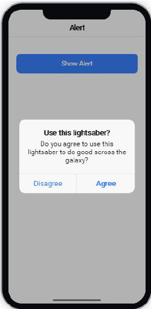

重点

点击确定，获取表单的值

```typescript
buttons: [
        {
            text: 'Cancel',
            role: 'cancel',
            cssClass: 'secondary',
            handler: () => {
                console.log('Confirm Cancel');
            }
        }, {
        text: 'Ok',
        handler: () => {
            console.log('Confirm Ok');
        }
    }
 ]
```


#### 3、Toast

官方文档：https://ionicframework.com/docs/api/toast

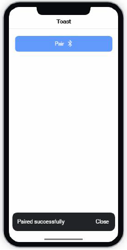


**重点**

自定义css样式，吧css放在全局样式中variables.scss或者global.scss中

```typescript
 async presentToast() {
    const toast = await this.toastController.create({
      message: '登录成功',
      duration: 2000,
      position: 'middle',
      color:'dark',
      cssClass:'mytoast'    /*cssClass必须写在全局*/
    });
    toast.present();
  }
```


#### 4、Loading

官方文档：https://ionicframework.com/docs/api/loading

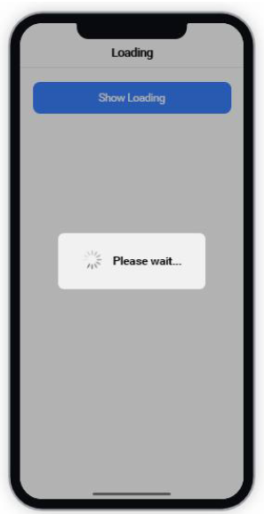


#### 5、Ionic4 手势相关事件

ionic4 中的gestures 手势事件包括: tap, press, pan, swipe, rotate, and pinch events 等。详细使用方法参考

详情参考：http://www.ionic.wang/article-index-id-155.html

##### 1、首先需要安装hammerjs

```
npm install hammerjs --save

```

##### 2、在项目的src/main.ts 中引入hammerjs

```
import 'hammerjs';

```

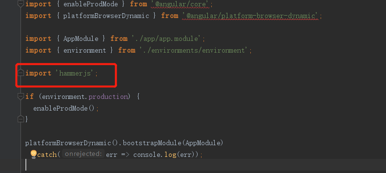

##### 3、在项目中使用

```html
<ion-button (press)="doPress()">
	长按触发的事件
</ion-button>
<ion-button (tap)="doTap()">
	点击触发的事件
</ion-button>
```

说明：如果未来的ionic4.x 版本可以直接使用手势事件的话忽略上面的安装引入过程。

**注意**:

点击空白，自定义的弹框消失的解决方法,加上backdropDismiss:false属性

```typescript
  async doPress(){
    const alert = await this.alertController.create({

      backdropDismiss:false,
      header: '提示',
      message: '确定要删除吗!',
      buttons: [
        {
          text: '取消',
          role: 'cancel',
          cssClass: 'secondary',
          handler: (blah) => {
            console.log('Confirm Cancel: blah');
          }
        }, {
          text: '确定',
          handler: () => {
            console.log('Confirm Okay');
          }
        }
      ]
    });
    await alert.present();
  }
```

演示代码:

<https://github.com/hufanglei/angular-it-demo/tree/ionic4-12>

### 13.Modal 以及Modal 传值

官方文档：https://ionicframework.com/docs/api/modal

Modal 模态对话框主要用于登录注册页面，我们可以把它理解为从页面底部弹出的另一个页面。

##### 1、Modal 模态对话框简介

官方文档：https://ionicframework.com/docs/api/modal

Modal 模态对话框主要用于登录注册页面，我们可以把它理解为从页面底部弹出的另一个页面。

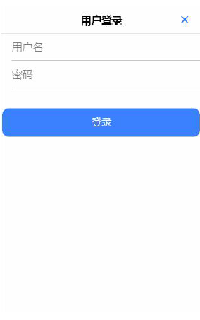


##### 2、Modal 模态对话框使用

比如我们想在modal 页面中弹出另一个页面

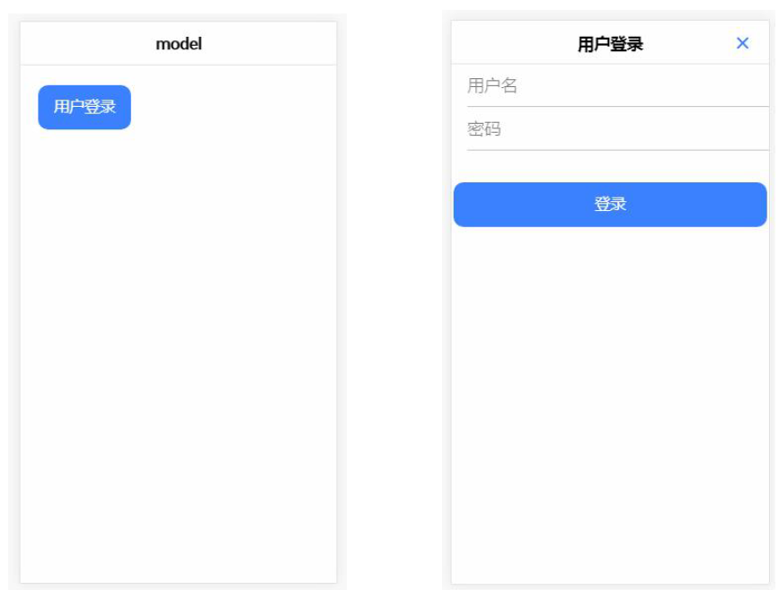


1、新建一个model 页面以及在model 页面下面新建一个组件。


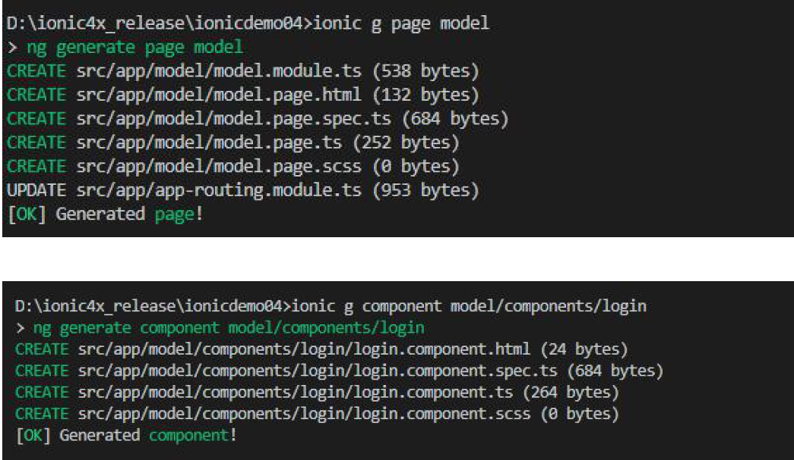


2、在model 页面所在的模块中引入刚才创建的login 组件，并声明

```typescript
import { LoginComponent} from './components/login/login.component';
```

```typescript
@NgModule({
    imports: [
        CommonModule,
        FormsModule,
        IonicModule,
        RouterModule.forChild(routes)
    ],
    declarations: [ModelPage,LoginComponent],
    entryComponents: [LoginComponent]
})
```

**注意**:

 entryComponents:[LoginComponent]，这个需要手动加一下

3、在modal 页面中引入刚才创建的login 组件，并且引入ModalController 弹出模态对话框，代码如下：

```typescript
import { Component, OnInit } from '@angular/core';
import { ModalController } from '@ionic/angular';
import { LoginComponent } from '../components/login/login.component';
@Component({
    selector: 'app-modal',
    templateUrl: './modal.page.html',
    styleUrls: ['./modal.page.scss'],
})
export class ModalPage implements OnInit {
    constructor(public modalController: ModalController) {}
    ngOnInit() {
    }
    async presentModal() {
        const modal = await this.modalController.create({
            showBackdrop:true,
            component: LoginComponent,
            componentProps: { value: 123 }
        });
        return await modal.present();
    }
}
```

3、Modal 页面给弹出的组件传值

①、modal 页面在componentProps 中给弹出的组件页面传值

```typescript
const modal = await this.modalController.create({
    showBackdrop:true,
    component: LoginComponent,
    componentProps: { value: 123 }
});
return await modal.present();
```

②、弹出的组件页面通过NavParams 接受modal 页面的传值

```typescript
import { Component, OnInit,Input } from '@angular/core';
import { NavParams } from '@ionic/angular';
@Component({
    selector: 'app-login',
    templateUrl: './login.component.html',
    styleUrls: ['./login.component.scss'],
})
export class LoginComponent implements OnInit {
    @Input() aid: any;
    constructor(public navParams: NavParams) {
// componentProps can also be accessed at construction time using NavParamsns
        console.log(this.navParams);
    }
    ngOnInit() {
    }
    closeModel(){
        this.navParams.data.modal.dismiss({
            'result': '消失的时候返回的内容'
        });
    }
}
```

4、弹出的组件关闭的时候给modal 页面传值

①、modal 监听关闭事件

```typescript
async showModel(){
    const modal = await this.modalController.create({
        component: LoginComponent,
        componentProps: { aid: '123' }
    });
    await modal.present();
//监听销毁的事件
    const { data } = await modal.onDidDismiss();
    console.log(data);
}
```

②、Login 组件关闭的时候传入数据

```typescript
closeModel(){
    this.navParams.data.modal.dismiss({
        'result': '消失的时候返回的内容'
    });
}
```

Login 组件完整代码：

```typescript
import { Component, OnInit,Input } from '@angular/core';
import { NavParams } from '@ionic/angular';
@Component({
    selector: 'app-login',
    templateUrl: './login.component.html',
    styleUrls: ['./login.component.scss'],
})
export class LoginComponent implements OnInit {
    @Input() aid: any;
    constructor(public navParams: NavParams) {
// componentProps can also be accessed at construction time using NavParamsns
        console.log(this.navParams);
    }
    ngOnInit() {
    }
    doClose(){
        this.navParams.data.modal.dismiss({
            'result': '消失的时候返回的内容'
        });
    }
}
```

```html
<ion-header>
    <ion-toolbar>
        <ion-title>用户登录</ion-title>
        <ion-buttons slot="end">
            <ion-button (click)="doClose()">
                <ion-icon slot="icon-only" name="close"></ion-icon>
            </ion-button>
        </ion-buttons>
    </ion-toolbar>
</ion-header>

<ion-content padding>

    <ion-list>
        <ion-item>
            <ion-label>用户名：</ion-label>
            <ion-input></ion-input>
        </ion-item>
        <ion-item>
            <ion-label>密　码：</ion-label>
            <ion-input></ion-input>
        </ion-item>

    </ion-list>

    <ion-button (click)="doLogin()" extends="block">
        登录
    </ion-button>
</ion-content>
```

**总结**

通过navParams来获取model和传递的值

- model组件的引入
- model组件的传值，父组件给model组件传值
- 获取model组件
- 关闭model组件, 父组件监听事件，model组件关闭组件方法中给父组件传值

源码地址:

<https://github.com/hufanglei/angular-it-demo/tree/ionic4-13>

### 14.ion-infinite-scroll上拉分页加载更多

1、ion-infinite-scroll 上拉分页加载更多(模拟)

官方文档：https://ionicframework.com/docs/api/infinite-scroll

```html
<ion-content>
    <ion-list>
        <ion-item *ngFor="let item of data">
            {{item}}
        </ion-item>
    </ion-list>
    <ion-infinite-scroll #myInfiniteScroll threshold="100px" (ionInfinite)="loadData($event)">
        <ion-infinite-scroll-content
                loadingSpinner="bubbles"
                loadingText="Loading more data...">
        </ion-infinite-scroll-content>
    </ion-infinite-scroll>
</ion-content>

```

```typescript
export class Tab2Page {
    @ViewChild('myInfiniteScroll') infiniteScroll: IonInfiniteScroll;
    public data:any[]=[];
    constructor() {
        for(var i=0;i<20;i++){
            this.data.push(`这是第${i}条数据`);
        }
    }
    loadData(event) {
        setTimeout(() => {
            for(var i=0;i<10;i++){
                this.data.push(`这是第${i}条数据`);
            }
            console.log('Done');
            event.target.complete();
            if (this.data.length == 1000) {
                event.target.disabled = true;
            }
        }, 500);
    }
    toggleInfiniteScroll() {
        this.infiniteScroll.disabled = !this.infiniteScroll.disabled;
    }
}
```

2、ion-infinite-scroll 请求api 接口实现上拉分页加载更多

**总结:**

1.ion-infinite-scroll 加载完成一次后需要调用的方法,用于更新数据

event.target.complete();

2.禁用ion-infinite-scroll

可以用js或者都没属性，原理都一样都是让 disable=true

event.target.disabled = true;

或者

```typescript
@ViewChild('infinite') myInfinite;
this.myInfinite.disabled=true;
```

代码地址:

<https://github.com/hufanglei/angular-it-demo/tree/ionic4-14>

## 五、Angular 中的数据交互（get jsonp post）

### 1、Angular get 请求数据

Angular5.x 以后get、post 和和服务器交互使用的是HttpClientModule 模块。

1、在app.module.ts 中引入HttpClientModule 并注入

```typescript
import {HttpClientModule} from '@angular/common/http';
```

```typescript
imports: [
        BrowserModule,
        HttpClientModule
  ]
```

2、在用到的地方引入HttpClient 并在构造函数声明

```typescript
import {HttpClient} from "@angular/common/http";
constructor(public http:HttpClient) { }
```

3、get 请求数据

```typescript
var api = "http://a.itying.com/api/productlist";
this.http.get(api).subscribe(response => {
	console.log(response);
});
```

### 2、Angular post 提交数据

Angular5.x 以后get、post 和和服务器交互使用的是HttpClientModule 模块。
1、在app.module.ts 中引入HttpClientModule 并注入

```typescript
import {HttpClientModule} from '@angular/common/http';
imports: [
	BrowserModule,
	HttpClientModule
]
```

2、在用到的地方引入HttpClient、HttpHeaders 并在构造函数声明HttpClient

```
import {HttpClient,HttpHeaders} from "@angular/common/http";

```

```
constructor(public http:HttpClient) { }

```

3、post 提交数据

```typescript
const httpOptions = {
	headers: new HttpHeaders({ 'Content-Type': 'application/json' })
};
var api = "http://127.0.0.1:3000/doLogin";
this.http.post(api,{username:'张三',age:'20'},httpOptions).subscribe(response => {
	console.log(response);
});
```

### 3、Angular Jsonp 请求数据

1、在app.module.ts 中引入HttpClientModule、HttpClientJsonpModule 并注入

```typescript
import {HttpClientModule,HttpClientJsonpModule} from '@angular/common/http';
```

```typescript
imports: [
	BrowserModule,
	HttpClientModule,
	HttpClientJsonpModule
]
```

2、在用到的地方引入HttpClient 并在构造函数声明

```
import {HttpClient} from "@angular/common/http";

```

```
constructor(public http:HttpClient) { }

```

3、jsonp 请求数据

```typescript
var api = "http://a.itying.com/api/productlist";
this.http.jsonp(api,'callback').subscribe(response => {
	console.log(response);
});
```

### 4、Angular 中使用第三方模块axios 请求数据

1、安装axios

```
cnpm install axios --save

```

2、用到的地方引入axios

```
import axios from 'axios';

```

3、看文档使用

```typescript

```

### 5.ion-infinite-scroll结合远程api接口实现上拉分页加载更多

封装httpservice服务

```typescript
export class HttpserviceService {
  constructor(public http:HttpClient) { }
  get(api){
    return new Promise((resolve,reject)=>{
        this.http.get(api).subscribe((response)=>{
          resolve(response);
        },(err)=>{
          reject(err);          
        })
    })
  }
}
```

```html
<ion-infinite-scroll threshold="10%" (ionInfinite)="loadMore($event)">
    <ion-infinite-scroll-content loadingSpinner="crescent" loadingText="加载中...">
    </ion-infinite-scroll-content>
</ion-infinite-scroll>

<p *ngIf="!hasMore">---我是有底线的---</p>
```

```typescript
 public list:any[]=[];

 public page:any=1;

 public hasMore=true;
 loadMore(e){
    var api='http://www.phonegap100.com/appapi.phpa=getPortalList&catid=20&page='+this.page;
      this.httpService.get(api).then((response:any)=>{
          console.log(response)
          this.list=this.list.concat(response.result);
          ++this.page;
          //判断下一页有没有数据
          if(response.result.length<20){
            e.target.disabled=true;
            this.hasMore=false;
          }
          e.target.complete(); //请求完成数据以后告诉ion-infinite-scroll更新数据
      })
  }
```

优化:

```typescript
export class Tab1Page {

  public list:any[]=[];

  public page:any=1;

  public hasMore=true;

  constructor(public httpService:HttpserviceService){

  } 
  ngOnInit(): void {    
      this.loadMore(null);
  }
 
  loadMore(e){    
      var api='http://www.phonegap100.com/appapi.php?a=getPortalList&catid=20&page='+this.page;
      this.httpService.get(api).then((response:any)=>{
          console.log(response)
          this.list=this.list.concat(response.result);
          ++this.page;
          //判断下一页有没有数据
          if(response.result.length<20){
            e?e.target.disabled=true:'';
            this.hasMore=false;
          }          
          e?e.target.complete():''; //请求完成数据以后告诉ion-infinite-scroll更新数据
      })
  }
}
```

### 6.ion-refresher 下拉更新

官方文档：https://ionicframework.com/docs/api/refresher

```html
<ion-content>
    <ion-refresher slot="fixed" (ionRefresh)="doRefresh($event)">
        <ion-refresher-content
                pullingIcon="arrow-dropdown"
                pullingText="Pull to refresh"
                refreshingSpinner="circles"
                refreshingText="Refreshing...">
        </ion-refresher-content>
    </ion-refresher>
</ion-content>
```

```typescript
import { Component } from '@angular/core';
@Component({
    selector: 'refresher-example',
    templateUrl: 'refresher-example.html',
    styleUrls: ['./refresher-example.css'],
})
```

```typescript
 export class RefresherExample {
    constructor() {}
    doRefresh(event) {
        console.log('Begin async operation');
        setTimeout(() => {
            console.log('Async operation has ended');
            event.target.complete();
        }, 2000);
    }
}
```


## 六、ionic4 路由跳转、ionic4 路由跳转传值NavController 返回上一页、NavController回到根

### 1、普通路由跳转

```HTML
<ion-button [routerLink]="['/pinfo']">
跳转到详情
</ion-button>
```

```html
<ion-header>
    <ion-toolbar>
        <ion-buttons slot="start">
            <ion-back-button defaultHref="/tabs/tab1" text="返回"></ion-back-button>
        </ion-buttons>
        <ion-title>pinfo</ion-title>
    </ion-toolbar>
</ion-header>
```

### 2、路由跳转传值

```html
<ion-button [routerLink]="['/pinfo']" [queryParams]="{aid:'1234'}">
    跳转到详情并传值
</ion-button>
```

```typescript
import { Component, OnInit } from '@angular/core';
import { ActivatedRoute } from '@angular/router';
@Component({
    selector: 'app-pinfo',
    templateUrl: './pinfo.page.html',
    styleUrls: ['./pinfo.page.scss'],
})
export class PinfoPage implements OnInit {
    constructor(public route:ActivatedRoute) { }
    ngOnInit() {
        this.route.queryParams.subscribe((data)=>{
            console.log(data);
        })
    }
}
```

### 3、NavController 返回上一页

Ionic4.x 中从tabs 切换页面跳转到其他页面，使用ion-back-button 返回的话，默认都会返回到tab1 页面。如果我们想从那个tab 页面跳转过去就返回到指定的tab 页面的话，这时候就要用到NavController 里面提到的back 方法。

```typescript
import { NavController } from '@ionic/angular';
constructor(public nav:NavController) { }
this.nav.back();
this.nav.navigateBack('/tabs/tab3');
```

完整代码:

```html
<ion-header>
    <ion-toolbar>
        <ion-buttons slot="start">
            <ion-button (click)="goBack()">
                <ion-icon slot="icon-only" name="arrow-back"></ion-icon>
            </ion-button>
        </ion-buttons>
        <ion-title>pinfo</ion-title>
    </ion-toolbar>
</ion-header>
```

```typescript
import { Component, OnInit } from '@angular/core';
import { ActivatedRoute } from '@angular/router';
import { NavController } from '@ionic/angular';
@Component({
    selector: 'app-pinfo',
    templateUrl: './pinfo.page.html',
    styleUrls: ['./pinfo.page.scss'],
})
export class PinfoPage implements OnInit {
    constructor(public route:ActivatedRoute,public nav:NavController) { }
    ngOnInit() {
        this.route.queryParams.subscribe((data)=>{
            console.log(data);
        })
        console.log(window.history);
    }
    goBack(){
        this.nav.navigateBack('/tabs/tab3');
    }
}
```

### 4、NavController 回到根

```typescript
import { NavController } from '@ionic/angular';
constructor(public nav:NavController) { }
this.nav.navigateRoot('/tabs/tab3');
```

代码地址：

<https://github.com/hufanglei/angular-it-demo/tree/ionic4-17>

## 七、ionic4.x 新闻app 案例

1、新闻app 案例截图

项目涉及知识点：
1、请求数据2、路由跳转传值3、上拉分页加载更多4、渲染HTML 5、ionic4.x 常用组
件的使用等...

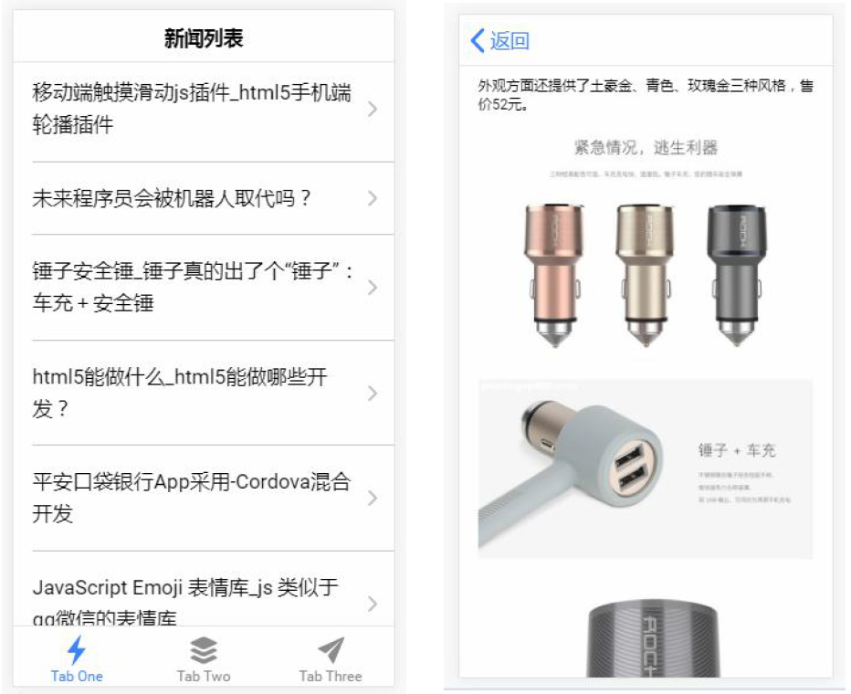

代码地址:

<https://github.com/hufanglei/angular-it-demo/tree/ionic4-18>

总结:

主要知识点:

1.封装http服务

2.上拉加载数据封装

3.加载时候显示动画

4.页面返回


## 八.京东商城项目


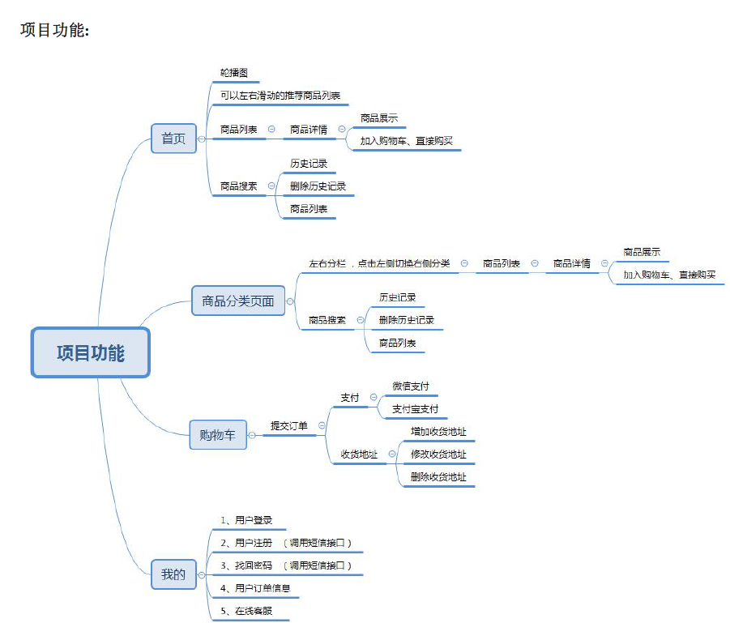

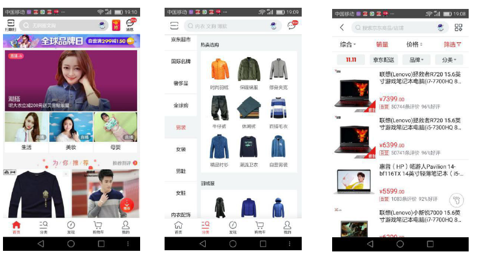

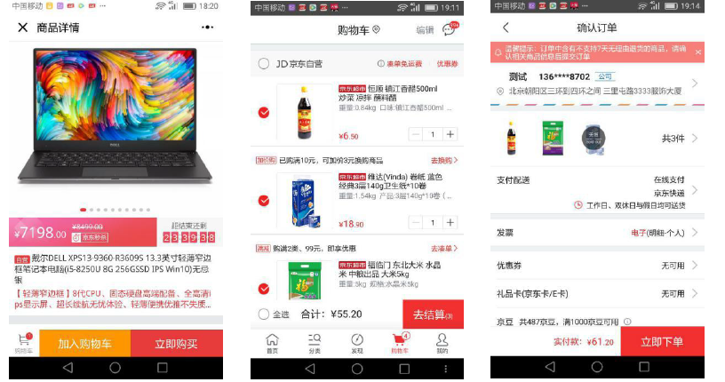

### 1.框架搭建修改tabs 颜色、配置android ios 使用同一个css 样式

#### 1、新增tab

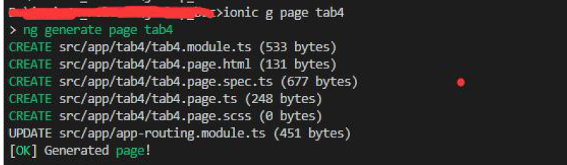

#### 2、配置底部tabs 图标、tabs 按钮颜色

图标：https://ionicons.com/

tabs 页面:

```html
<ion-tabs>
    <ion-tab-bar slot="bottom">
        <ion-tab-button tab="tab1">
            <ion-icon name="home"></ion-icon>
            <ion-label>首页</ion-label>
        </ion-tab-button>
        <ion-tab-button tab="tab2">
            <ion-icon name="ios-apps"></ion-icon>
            <ion-label>分类</ion-label>
        </ion-tab-button>
        <ion-tab-button tab="tab3">
            <ion-icon name="ios-cart"></ion-icon>
            <ion-label>购物车</ion-label>
        </ion-tab-button>
        <ion-tab-button tab="tab4">
            <ion-icon name="contacts"></ion-icon>
            <ion-label>我的</ion-label>
            </ion-tab-button>
</ion-tab-bar>
</ion-tabs>
```

图标颜色Theme variables.scss:

<https://ionicframework.com/docs/api/tab-button>

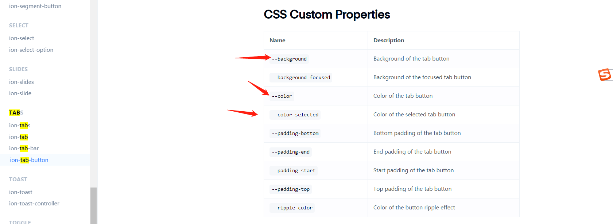

```scss
ion-tab-button{
  --color:#8C8E8C;
  --color-selected:#F53D3D;
}
```

#### 3.Android Ios 配置统一样式

```typescript
@NgModule({
    declarations: [AppComponent],
    entryComponents: [],
    imports: [BrowserModule, IonicModule.forRoot({
        mode:'ios', //配置android ios 都使用一个样式
        backButtonText:"返回" //配置默认的返回按钮
    }), AppRoutingModule,HttpClientModule],
    providers: [
        StatusBar,
        SplashScreen,
        HttpserviceService,
        { provide: RouteReuseStrategy, useClass: IonicRouteStrategy }
    ],
    bootstrap: [AppComponent]
})
```

点击

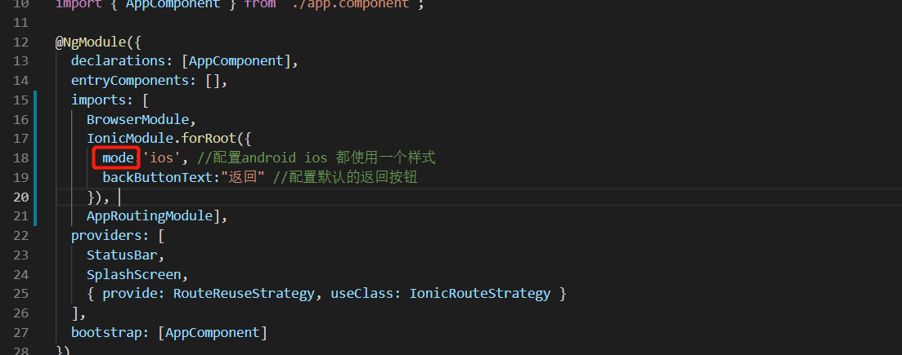


以上为forROOT参数对象里面可以配置的属性

代码地址:

<https://github.com/hufanglei/angular-it-demo/tree/ionic4-19>

### 2.ionic 仿照京东商城项目首页布局导航搜索、轮播图、滑动列表


图标：https://ionicons.com/
轮播图：https://ionicframework.com/docs/api/slides
栅格：https://ionicframework.com/docs/api/grid

#### 1.定义公共的样式

global.scss

```scss
/*自定义的全局css样式*/
  body, div, ul, li, ol, h1, h2, h3, h4, h5, h6, input, textarea, select, p, dl, dt, dd, a, img, button, form, table, th, tr, td, tbody, article, aside, details, figcaption, figure, footer, header, hgroup, menu, nav, section {
    margin: 0;
    padding: 0;
  }
  html{
    font-size: 62.5%;    // 浏览器的默认字体大小是16px          16*62.5%=10px
  }
  .clearfix{  
    &::after{
      display: block;
      content: "";
      height: 0px;
      clear: both;
    }
  } 
  ul,ol{
    list-style-type: none;
  }
```

#### 2.设置搜索栏

1.使用32位的阿里巴巴图标png

2.tab1页面

```html
<ion-header>
  <ion-toolbar>
    <ion-buttons slot="start">
       
    </ion-buttons>  
     <ion-searchbar placeholder="请输入关键词" animated></ion-searchbar>
    <ion-buttons slot="end" class="message">
        
        <ion-badge color="danger" class="badge">8</ion-badge>
     </ion-buttons>
  </ion-toolbar>
</ion-header>
```

tab1.page.scss

```scss
.message{
  position: relative;
  .badge{
    position: absolute;
    right: -4px;
    top:-4px;
    font-size: 1rem;
  }
}
```

#### 3.设置轮播

设置slide宽度自适应

tab1.page.scss

```scss
ion-slide{
  width: 100%;
  height: 150px;
  overflow: hidden;
  img{
    max-width: 100%;
  }
}
```

​    //手动滑动完成 

```typescript
 slideTouchEnd(){   
    this.slide1.startAutoplay();
  }
```

```html
  <ion-slides pager="true" #slide1 [options]="slidesOpts" (ionSlideTouchEnd)="slideTouchEnd()">
    <ion-slide *ngFor="let item of slidesList">
        
    </ion-slide>
  </ion-slides>

```

#### 4.猜你喜欢

```html
  <div class="h_title">
          猜你喜欢 
      </div>
```

```scss
.hotlist{
  width: 100%;
  height: 10rem;
  overflow-x: auto;
  overflow-y: hidden;

  ul{

    // width: 120rem;  动态宽度

    li{
      width: 8rem;
      height:10rem;
      float: left;
      margin-left: 1rem;

      img{
        width: 7rem;
        height: 7rem;
      }
      p{
        padding: .4rem;
        text-align: center;
      }
    }
  }

```

#### 5.横向滚动条

```html
<div class="hotlist">
          <ul class="clearfix" [ngStyle]="{'width': hotListWidth}">
            <li *ngFor="let item of hotList">
    
                
               <p>{{item.title}}</p>
            </li>
          </ul>    
      </div>
```

```typescript
  for(var i=1;i<=7;i++){
      this.hotList.push({
        pic:'assets/0'+i+'.jpg',
        title:'第'+i+'个',
      })
    }

    //计算hotListWidth的宽度
    this.hotListWidth=this.hotList.length*9+'rem';
```

```scss
.hotlist{
  width: 100%;
  height: 10rem;
  overflow-x: auto;
  overflow-y: hidden;

  ul{
    // width: 120rem;  动态宽度
    li{
      width: 8rem;
      height:10rem;
      float: left;
      margin-left: 1rem;

      img{
        width: 7rem;
        height: 7rem;
      }
      p{
        padding: .4rem;
        text-align: center;
      }
    }
  }
```

代码地址:

<https://github.com/hufanglei/angular-it-demo/tree/ionic4-20>


### 3.ionic 仿照京东商城项目首页商品列表以及商品分类布局

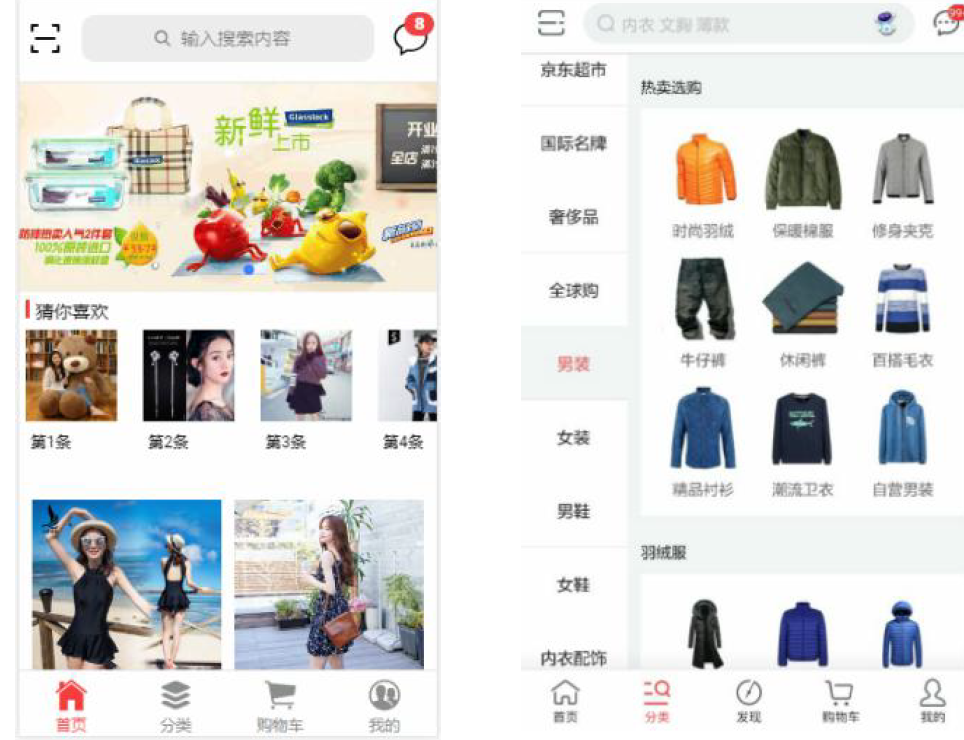


#### 1.gird布局商品列表tab1

<https://ionicframework.com/docs/layout/grid>

```html
 <ion-grid>
      <ion-row>
        <ion-col size="6" *ngFor="let item of pList">
          
          <p>{{item.title}}</p>
        </ion-col>      
      </ion-row>
    </ion-grid>
```


#### 2.flex布局分类tab2

```html
  <div class="cate_content">
    <div class="cate_left">
      <ion-list lines="full">
        <ion-item *ngFor="let item of lCateList">
          <ion-label>{{item}}</ion-label>
        </ion-item>
      </ion-list>
    </div>

    <div class="cate_right">

      <ion-grid fixed>
        <ion-row>
          <ion-col size="4" *ngFor="let item of rCateList">
            
            <p>{{item.title}}</p>
          </ion-col>
        </ion-row>
        <ion-row>
          <ion-col size="4" *ngFor="let item of rCateList">
            
            <p>{{item.title}}</p>
          </ion-col>
        </ion-row>
        <ion-row>
          <ion-col size="4" *ngFor="let item of rCateList">
            
            <p>{{item.title}}</p>
          </ion-col>
        </ion-row>
        <ion-row>
          <ion-col size="4" *ngFor="let item of rCateList">
            
            <p>{{item.title}}</p>
          </ion-col>
        </ion-row>
      </ion-grid>
    </div>
  </div>
```

```typescript
public lCateList:any[]=[];
  public rCateList:any[]=[];
  constructor(){
    //左侧模拟数据
    for(let i=0;i<16;i++){      
      this.lCateList.push(`分类${i}`);
    }

    //右侧数据
    for(var i=1;i<=12;i++){
      this.rCateList.push({
        pic:'assets/list'+i+'.jpg',
        title:'第'+i+'个',
      })
    }

  }
}
```

代码:

<https://github.com/hufanglei/angular-it-demo/tree/ionic4-21>

### 4.购物车页面布局

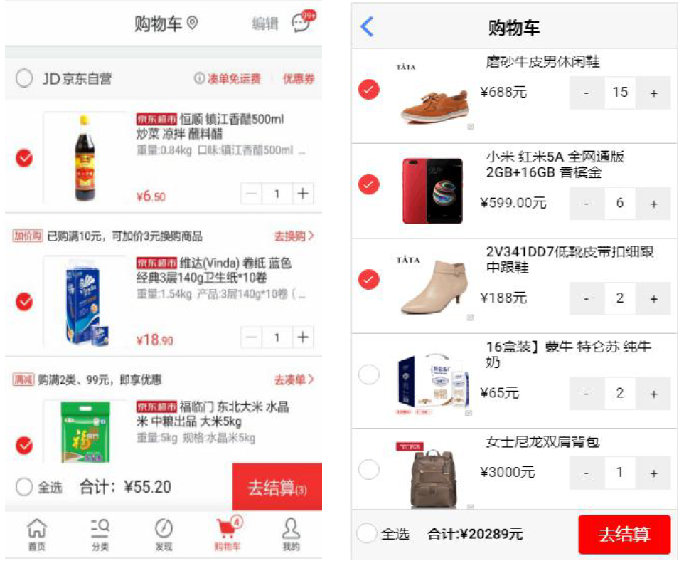

购物车页面布局

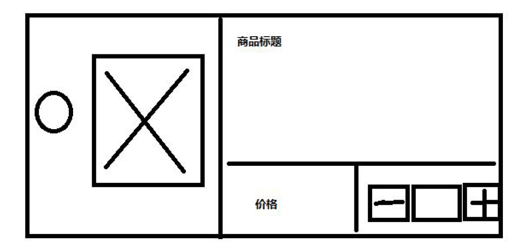

注意:

buton按钮默认没有背景,加上fill属性

```html
<ion-buttons slot="end" class="checkout_btn">      
      <ion-button color="danger" fill="solid">
        去结算
      </ion-button>
</ion-buttons>
```

tab3代码地址:

<https://github.com/hufanglei/angular-it-demo/tree/ionic4-22>

### 5.用户中心页面布局和真机热部署

#### 1.用户中心页面布局

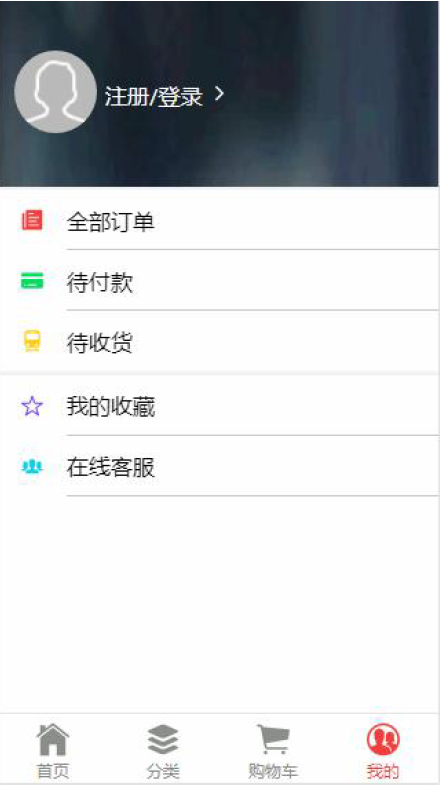

#### 2.真机调试热更新

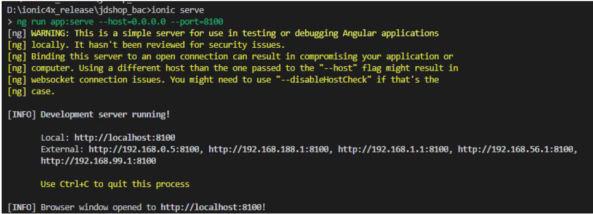

手机和电脑处于同一个局域网，通俗的说就是连一个路由器，这样的话手机上面输入ionicserve 的ip 地址就可以调试电脑上面运行的程序，并且会热更新。

tab4代码地址:

<https://github.com/hufanglei/angular-it-demo/tree/ionic4-23>

### 6.搜索页面、商品列表、页面布局

ionic4.x 仿京东商城搜索页面商品列表页面布局

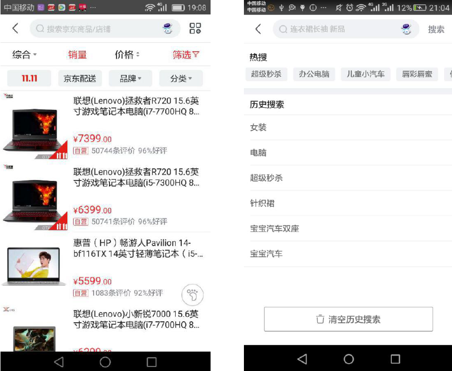

总结:

#### 1.使用nav的 navigateForward方法

商品页面和分类页面跳转到搜索页面

*此方法使用Angular的[Router]（https://angular.io/api/router/Router），*它相当于调用`this.router.navigateByUrl（）`，但它明确指出**方向**过渡期。* *前进**意味着它将被推送到插座堆栈的新页面（离子路由器插座）*，默认情况下它将显示“前进”动画。* *也可以通过使用`[routerDirection]`指令以声明方式触发向前导航：* *```html * <a routerLink="/path/to/page" routerDirection="forward">链接。

```typescript
navigateForward(url: string | UrlTree | any[], options?: NavigationOptions): Promise<boolean>;
```

代码:

```html
<ion-searchbar placeholder="请输入关键词" animated (tap)="goSearch()"></ion-searchbar>
```

```typescript
 import { NavController } from '@ionic/angular';
  constructor(public navController:NavController){
     //跳转到搜索页面
  goSearch(){
    this.navController.navigateForward('/search');
  }
```

代码:

<https://github.com/hufanglei/angular-it-demo/tree/ionic4-24>

#### 2.使用nav的back方法返回

search页面返回首页或者分类页面

```html
 <ion-buttons slot="start">
      <ion-button (tap)="goBack()">
        <ion-icon slot="icon-only" name="arrow-back" color="dark"></ion-icon>
      </ion-button>
</ion-buttons>
```

```
 goBack(){
    this.navController.back();
  }

```


#### 3.设置二级导航

```html
 <ion-toolbar class="sub_toolbar" *ngIf="!flag">   
     <div class="subheader">
        <div>综合</div>
        <div>销量</div>
        <div>价格</div>
     </div>
  </ion-toolbar>
```

```scss
.sub_toolbar{     
    --min-height:3rem;
    .subheader{
        border-top:1px solid #eee;
        display: flex;    
        align-items: center;
        height:3rem;
        div{    
            flex: 1;
            text-align: center;
        }
    }
}
```

#### 4.注意修改样式的思路

①浏览器定位元素，看下直接给元素样式可否

②复制定位元素影响生效的样式，直接覆盖

③查看官网看是否有定义的带--类型的样式可以自定义

代码:

<https://github.com/hufanglei/angular-it-demo/tree/ionic4-25>

### 7.登录，注册，发送验证码

1.登录页面布局

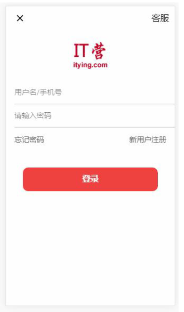

①修改导航栏的颜色

查看ion-toolbar的文档

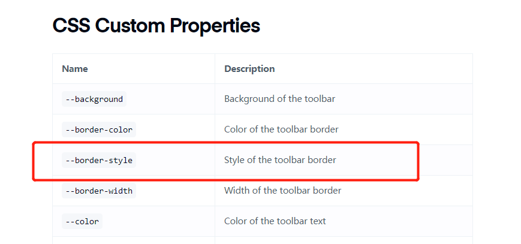

```scss
.login_toolbar{
    --border-color:#fff;
}
```

2.用户注册页面布局

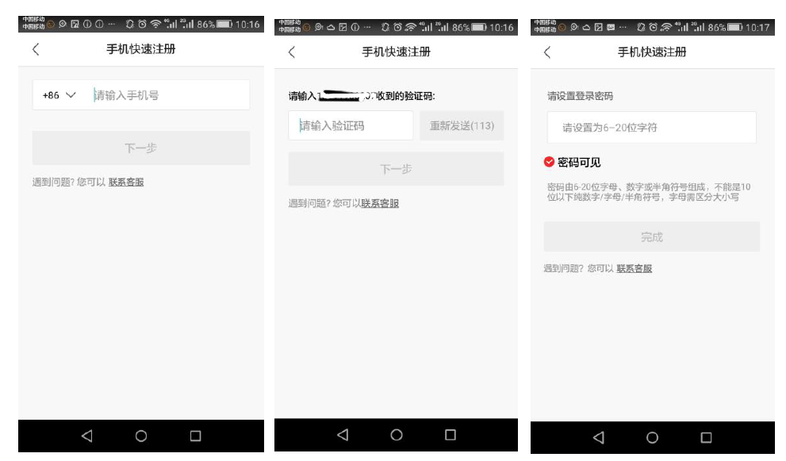

代码:

<https://github.com/hufanglei/angular-it-demo/tree/ionic4-26>

### 8.注册页面布局

修改ion-item的样式

```scss
 ion-item{
        --padding-start:1rem;
        --padding-end:1rem;
    }
```

<https://github.com/hufanglei/angular-it-demo/tree/ionic4-27>

### 9.创建公共请求数据的服务、以及请求api 接口实现动态轮播图

#### 1.创建公共请求数据的服务

#### 2.轮播图接口

请求方式：get

<https://github.com/hufanglei/angular-it-demo/tree/ionic4-28>


### 10.请求Api 接口获取首页猜你喜欢、精品推荐动态数据

#### 1.商品列表Api 接口

请求方式：get

传参说明：
参数说明备注
page 第几页可选
pageSize 每一页返回的数据可选
cid 分类id 可选/分类必填
search 搜索关键词可选/搜索必填
is_best 精华
is_hot 热门
is_new 新品 

返回参数说明：
参数说明备注
_id 商品id
title 商品标题
cid 分类id
price 价格
old_price 原价
pic 图片地址
s_pic 缩略图地址

#### 2.首页商品Api 接口

- 猜你推荐
- 热门推荐

### 11.商品分类页面请求动态数据，实现tab 切换以及选中

#### 1.商品分类页面Api 接口

请求方式：get
地址：http://jd.itying.com/api/pcate
传参说明：
参数 说明 备注
pid 上级分类的id，顶级分类可以不传 可选
返回参数说明：
参数说明
_id 分类id
pic 图片地址
title 标题
pid 上级分类id
sort 排序

#### 2.商品分类页面请求地址

一级分类：
http://jd.itying.com/api/pcate
二级分类：
http://jd.itying.com/api/pcate?pid=59f1e1ada1da8b15d42234e9

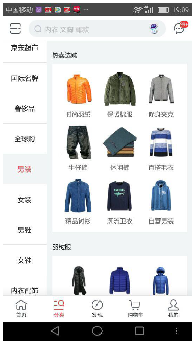

左侧分类选中显示

```html
 <ion-list lines="full">
        <ion-item *ngFor="let item of lCateList" (tap)="getRightCateData(item._id)" [ngClass]="{'active': item._id==selectedId}">
          <ion-label>{{item.title}}</ion-label>
        </ion-item>
      </ion-list>
```

```
 ion-item{                
            font-size: 1.3rem;
            --background: #eee;
        }    
        ion-item.active{
            --background: #fff;
        }

```


```typescript
 public selectedId:any='';  /*选中的id*/
  getRightCateData(pid){    
    //http://jd.itying.com/api/pcate?pid=59f1e1ada1da8b15d42234
    this.selectedId=pid;
    var api="api/pcate?pid="+pid;
    this.common.ajaxGet(api).then((response:any)=>{
        this.rCateList=response.result;
    })    
  }
```

代码:

<https://github.com/hufanglei/angular-it-demo/tree/ionic4-30>

### 12.商品列表页面根据价格、销量属性筛选排序以及IonContent 回到顶部功能

#### 1.商品列表Api 接口

传参说明：
参数说明备注
page 第几页可选
pageSize 每一页返回的数据可选
cid 分类id 可选/分类必填
search 搜索关键词可选/搜索必填
is_best 精华
is_hot 热门
is_new 新品
sort 排序价格升序sort=price_1价格降序sort=price_-1销量升序sort=salecount_1销量降序sort=salecount_-1

返回参数说明：
参数说明备注
_id 商品id
title 商品标题
cid 分类id
price 价格
old_price 原价
pic 图片地址
s_pic 小图片地址

1.商品分类页面传递分类id到商品列表页面

tab2页面

```html
<ion-row>
          <ion-col size="4" *ngFor="let item of rCateList" [routerLink]="['/productlist']" [queryParams]="{cid:item._id}">
            
            <p>{{item.title}}</p>
          </ion-col>
        </ion-row>      
```

2.产品列表页面

```typescript
  ngOnInit() {
      //获取get传值
      this.activatedRoute.queryParams.subscribe((data:any)=>{        
        this.cid=data.cid;
        this.getProductList(null);      
    })
   
  }  
```


#### 2.商品搜索Api ,选中并且排序

如果下面地址失效，请访问API 接口实时更新地址：https://www.itying.com/article-11.html
http://jd.itying.com/api/plist?search=%E7%94%B5%E8%84%91&page=1

```typescript
 constructor(public navController:NavController,public common:CommonService,public activatedRoute:ActivatedRoute) {
      this.config=this.common.config;

      this.subHeaderList=[
        {
          id:1,
          title:"综合",
          fileds:"all",
          sort:-1       //排序     升序：price_1     {price:1}        降序：price_-1   {price:-1}
        },
        {
          id:2,
          title:"销量",
          fileds:'salecount',
          sort:-1
        },
        {
          id:3,
          title:"价格",
          fileds:'price',
          sort:-1
        }
        
      ]

   }
```

初始化时默认排序

```typescript
 getProductList(event){

    if(this.sort){
      var api='api/plist?cid='+this.cid+"&page="+this.page+'&sort='+this.sort;
    }else{
      var api='api/plist?cid='+this.cid+"&page="+this.page;
    }
   
    this.common.ajaxGet(api).then((response:any)=>{
      console.log(response);
      this.productList=this.productList.concat(response.result);
      this.page++;
      event?event.target.complete():'';

      //判断是否有数据
      if(response.result.length<10){
        event?event.target.disabled=true:"";
      }

    })
  }
```

```html
 <ion-toolbar class="sub_toolbar" *ngIf="!flag">   
      <div class="subheader"> 
         <div *ngFor="let item of subHeaderList" (click)="subHeaderChange(item.id)" [ngClass]="{'active': subHeaderSelected==item.id}">           
          {{item.title}}
        </div>
        
      </div>
   </ion-toolbar>
```

```typescript
//属性筛选
  subHeaderChange(id){  
    this.subHeaderSelected=id;   //颜色选中
    this.sort=this.subHeaderList[id-1].fileds+'_'+this.subHeaderList[id-1].sort;  //拼接排序字段
    this.page=1;   //重置分页数据
    this.productList=[];   //重置商品数据
    this.subHeaderList[id-1].sort=this.subHeaderList[id-1].sort*-1; //改变排序状态    
    this.content.scrollToTop(0);//回到顶部   
    this.getProductList(null); //请求数据
  }
```

#### 3.Ionic4 回到顶部功能

```typescript
import { Component, OnInit,ViewChild} from '@angular/core';
import { NavController,IonContent } from '@ionic/angular';
@ViewChild(IonContent) content: IonContent;
this.content.scrollToTop(0); /*回到顶部*/
```

### 13.商品搜索页面请求动态数据以及实现上拉分页加载更多

<https://github.com/hufanglei/angular-it-demo/tree/ionic4-33>

### 14.搜索页面历史记录

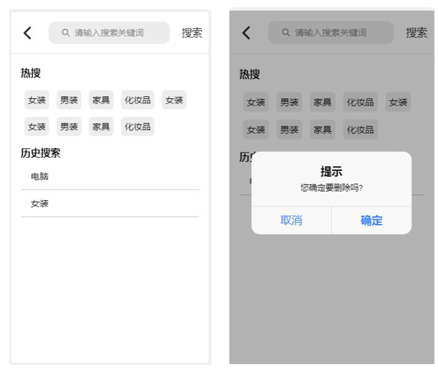

删除的代码

```typescript
async removeHistory(key) {
    const alert = await this.alertController.create({
      backdropDismiss:false,
      header: '提示！',
      message: '确定要删除吗?',
      buttons: [
        {
          text: '取消',
          role: 'cancel',
          cssClass: 'secondary',
          handler: (blah) => {
            console.log('Confirm Cancel: blah');
          }
        }, {
          text: '删除',
          handler: () => {
            // console.log('Confirm 执行删除'+key);
            this.historyList.splice(key,1);
            this.storage.set('historylist', this.historyList);
          }
        }
      ]
    });
    await alert.present();
  }
```

代码地址:

<https://github.com/hufanglei/angular-it-demo/tree/ionic4-34>

### 15.商品详情页面布局

商品详情页面布局

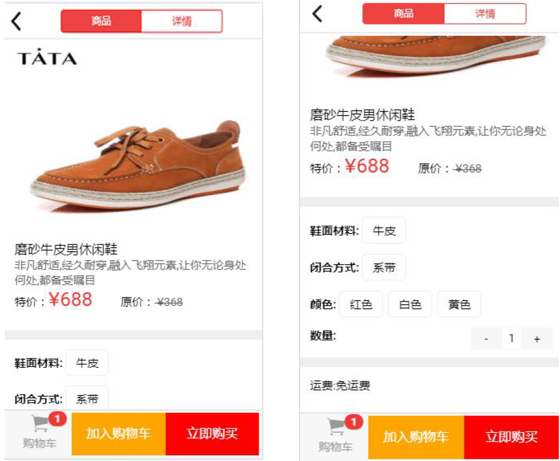

总结：

1.主要是segment的使用和底部footbar的布局

2.商品详情页的布局

3.商品详情Api 接口

4.Ionic 解析html 数据

```html
public h="<h2>这是一个h2</h2>";
```

```html
<span [innerHTML]='h'></span>
```

代码地址:

<https://github.com/hufanglei/angular-it-demo/tree/ionic4-37>


### 16.注册流程POST 封装，以及POST发送验证码倒计时功能

#### 1.用户注册流程

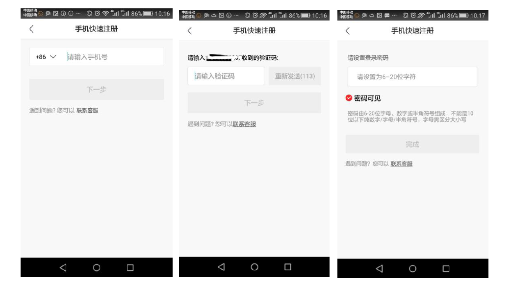

#### 2.Post 请求数据封装

Angular5.x 以后get、post 和和服务器交互使用的是HttpClientModule 模块。

##### 1、在app.module.ts 中引入HttpClientModule 并注入

```typescript
import {HttpClientModule} from '@angular/common/http';
```

```typescript
imports: [
	BrowserModule,
    HttpClientModule
]
```

##### 2、在用到的地方引入HttpClient、HttpHeaders 并在构造函数声明HttpClient

```
import {HttpClient,HttpHeaders} from "@angular/common/http";

```

```
constructor(public http:HttpClient) { }

```

##### 3、post 提交数据

```typescript
const httpOptions = {
	headers: new HttpHeaders({ 'Content-Type': 'application/json' })
};
var api = "http://127.0.0.1:3000/doLogin";
this.http.post(api,{username:'张三',age:'20'},httpOptions).subscribe(response => {
console.log(response);
});
```

#### 3.发送验证码接口

请求方式：post
地址：域名/api/sendCode
http://jd.itying.com/api/sendCode
传参说明：

| 参数 | 说明     | 备注 |
| ---- | -------- | ---- |
| tel  | 电话号码 | 必传 |

#### 4、验证码验证接口

请求方式：post

地址：域名/api/validateCode

传参说明：

| 参数 | 说明     | 备注 |
| ---- | -------- | ---- |
| tel  | 电话号码 | 必传 |
| code | 验证码   | 必传 |

#### 5.用户注册接口

请求方式：post

地址：域名/api/register

| 参数     | 说明     | 备注 |
| -------- | -------- | ---- |
| tel      | 电话号码 | 必传 |
| password | 密码     | 必传 |
| code     | 验证码   | 必传 |

返回参数：

| 参数     | 说明         | 备注 |
| -------- | ------------ | ---- |
| _id      | 用户         | id   |
| username | 用户名       |      |
| tel      | 手机号       |      |
| password | 用户密码     |      |
| salt     | 用户唯一编码 |      |

注册成功回到根

```typescript
  this.common.ajaxPost(api,postJson).then((response:any)=>{
            console.log(response);
            if(response.success){
                // 1、保存用户信息         2、跳转到首页
                this.storage.set('userinfo',response.userinfo[0]);
                //回到根
                this.navController.navigateRoot('/tabs/tab4');    

            }else{
              alert('注册失败');
            }

        })
```

代码地址:

<https://github.com/hufanglei/angular-it-demo/tree/ionic4-39>

### 17.用户登录退出登录ionic4.x 生命周期函数Ionic4.x 用EventEmitter 事件驱动实现页面通讯

#### 1、用户中心页面、账户管理页面制作

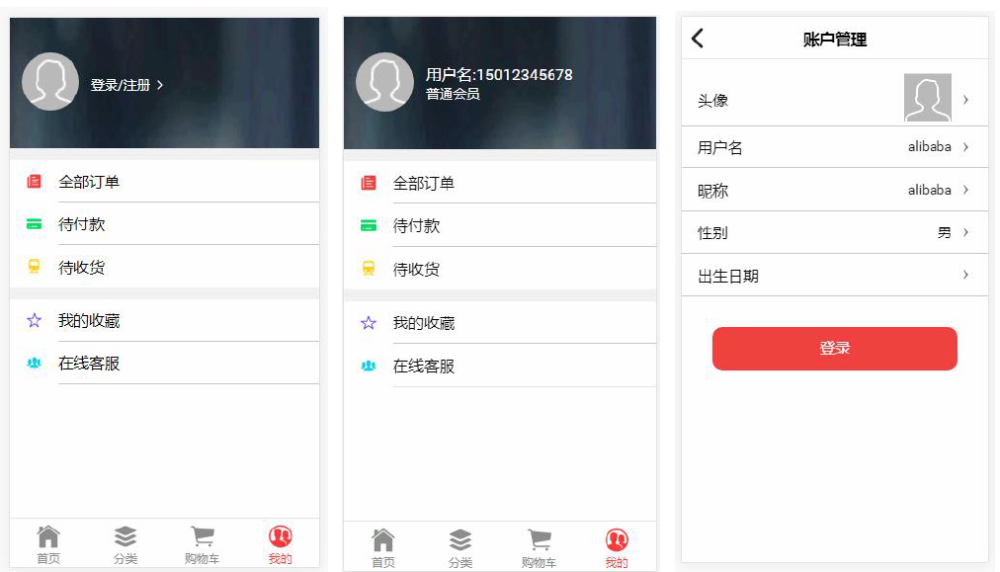

#### 2、登录接口

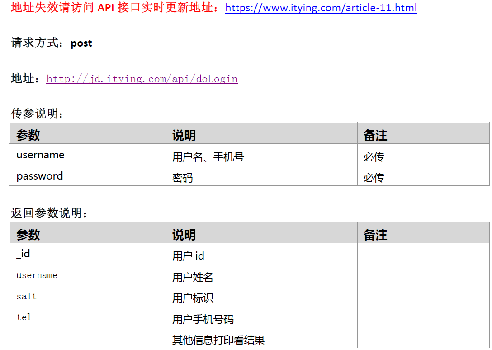

#### 3、ionic4.x 生命周期函数

**Ionic4 中内置的生命周期函数：**
ionViewWillEnter —当进入一个页面时触发(如果它从堆栈返回)
ionViewDidEnter —进入后触发
ionViewWillLeave —如果页面将离开触发
ionViewDidLeave — 在页面离开后触发
ionViewWillUnload — 页面卸载的时候会触发，如果无法触发使用ngOnDestroy
**Ionic4 可以使用的Angular 生命周期函数**
1、ngOnChanges 当被绑定的输入属性的值发生变化时调用(父子组件传值的时候会触发）
2、ngOnInit 请求数据一般放在这个里面（重要*）
3、ngDoCheck 检测，并在发生Angular 无法或不愿意自己检测的变化时作出反应

4、ngAfterContentInit 当把内容投影进组件之后调用
5、ngAfterContentChecked 每次完成被投影组件内容的变更检测之后调用
6、ngAfterViewInit 初始化完组件视图及其子视图之后调用（dom 操作放在这个里面）（重
要）
7、ngAfterViewInit 每次做完组件视图和子视图的变更检测之后调用
8、ngOnDestroy 组件销毁后执行（重要）

#### 4、ionic4.x 中使用EventEmitter 事件驱动实现页面通讯

1、Eventemitter Github 地址：https://github.com/primus/eventemitter3
2、安装配置EventEmitter：

```
npm install --save eventemitter3

```

3、定义公共的服务配置EventEmitter：

```typescript
import { Injectable} from '@angular/core';
import {EventEmitter} from 'eventemitter3';
@Injectable({
	providedIn: 'root'
})
export class EventService {
	public eventEmit: any;
    constructor() {
		// 定义发射事件
		this.eventEmit = new EventEmitter();
	}
}
```

4、用户中心页面监听事件广播

```typescript
import { EventService } from '../services/event.service';
this.eventService.eventEmit.on('login',(result)=>{
	console.log('执行');
})
```

5、登录页面返回的时候发送广播

```typescript
import { EventService } from '../services/event.service';
ionViewDidLeave(){
	this.eventService.eventEmit.emit('login','登录页面退出了');
}
```

总结：

解决的问题:

 在页面tab切换  以及第一次加载的时候会触发    但是login返回的时候没法触发，原理：ionic4比ionic3优化了页面，tab4页面没有卸载。

tab4代码

```typescript
 constructor(public storage:StorageService,public eventService:EventService) {
      //初始化用户信息
      var userinfo=this.storage.get('userinfo');
      if(userinfo && userinfo.username){
        this.userinfo=userinfo;
      }else{
        this.userinfo='';
      }    
   }

  ngOnInit() {
    // console.log('ngOnInit');
    //监听注册 登录成功的事件
    this.eventService.event.on('useraction',()=>{
        var userinfo=this.storage.get('userinfo');
        if(userinfo && userinfo.username){
          this.userinfo=userinfo;
        }else{
          this.userinfo='';
        }       
    })
```

login.ts

```typescript
  doLogin(){
    if(this.userinfo.username==''){
      alert('用户名不能为空');
    }else if(this.userinfo.password.length<6){
      alert('密码错误');
    }else{
        var api="api/doLogin";
        this.common.ajaxPost(api,{
          username:this.userinfo.username,
          password:this.userinfo.password,
        }).then((response:any)=>{
            console.log(response);
            if(response.success){
              //1、保存用户信息   2、跳转到用户中心 (根)
              this.storage.set('userinfo',response.userinfo[0]);
              this.navController.navigateRoot('/tabs/tab4');
              //通知用户中心更新用户信息
              this.eventService.event.emit('useraction');
            }else{
              alert(response.message);     //toast
            } 
        })
    }
  }
```

代码地址（login模块，tab4模块）：

<https://github.com/hufanglei/angular-it-demo/tree/ionic4-40>

#### 5.自定义日期组件的Options

模板中：

```html
<ion-datetime display-format="YYYY-MM-DD" [pickerOptions]="customPickerOptions" ></ion-datetime>
```

业务逻辑中:

```typescript
public customPickerOptions = {
    buttons: [{
        text: '取消',
        handler: () => console.log('Clicked Save!')
    }, {
        text: '保存',
        handler: () => {
            console.log('Clicked Log. Do not Dismiss.');
        }
    }]
}
```

#### 6.注册页面注册成功通知用户中心更新用户状态账户设置退出登录

<https://github.com/hufanglei/angular-it-demo/tree/ionic4-41>


### 18.商品属性选择、增加到购物车

#### 1、操作DOM 节点选择商品属性


```typescript
 changeAttr(e) {
    console.log(e.srcElement.nodeName);
    if (e.srcElement.nodeName == 'SPAN') {
      var el = e.srcElement;   //获取当前点击的span DOM节点
      var parent = el.parentNode;//获取当前节点的父亲节点  
      var attrChildren = parent.children; //通父亲节点找到孩子节点 
      for (var i = 0; i < attrChildren.length; i++) {//让所有的子节点去掉 active  class
        attrChildren[i].className = '';
      }
      el.className = "active";    //给当前dom节点加一个active的 class
    }
  }
```

```html
 <div id="myAttr" (click)="changeAttr($event)">
     <div class="attr" *ngFor="let items of list.attr;">
           <strong>{{items.cate}}：</strong>
                <span [ngClass]="{'active': key==0}" *ngFor="let attr of items.list;let key=index;">{{attr}}</span>                      
           </div>
 </div>

```

   技巧: 设置第一个元素选中

```scss
[ngClass]="{'active': key==0}"
```

​                                                                                                         

#### 2、加入购物车

```typescript
  //加入购物车

  addCart() {
    var product_title = this.list['title'];
    var product_id = this.list['_id'];
    var product_pic = this.list['pic'];
    var product_price = this.list['price'];
    var product_count = this.num;  /*商品数量*/

    var product_attrs: any = '';

    var spanActive = document.querySelectorAll('#myAttr .active');

    for (var i = 0; i < spanActive.length; i++) {
      if(i==0){
        product_attrs += spanActive[i].innerHTML;

      }else{
        product_attrs += "　"+spanActive[i].innerHTML;

      }

    }
```

代码地址:

<https://github.com/hufanglei/angular-it-demo/tree/ionic4-42>

#### 3、显示购物车数据

<https://github.com/hufanglei/angular-it-demo/tree/ionic4-43>

#### 4.购物车全选反选功能以及商品详情页面跳转到购物车、以及保存购物车数据

### 19.签名原理

#### 1、为什么要签名验证

1、为什么要签名验证
我们通过http Post 或者Get 方式请求服务器的时候，会面临着许多的安全性问题，例如：
1、请求来源(身份)是否合法？
2、请求参数被篡改？
3、请求的唯一性(不可复制)
项目中用户登录后以后才能访问的信息，请求api 接口的时候为了安全，需要做签名验证。

2、签名验证实现原理
1、用户登录成功后服务器会返回用户信息以及salt

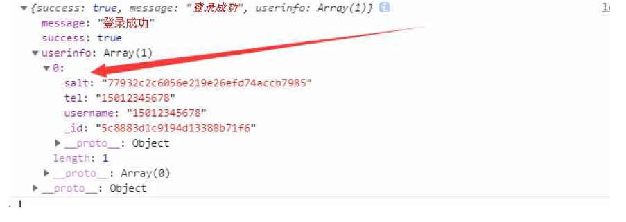

salt 是用户注册的时候随机生成的字符串然后通过md5 加密得到的，每个用户的salt 不一样

2、请求接口的时候在接口中加入sign 签名
如以前的请求方式：
http://jd.itying.com/api/addressList?uid=5a18fe9983796b0dc0542f99
现在的请求方式：
http://jd.itying.com/api/addressList?uid=5a18fe9983796b0dc0542f99&sign=fee452295f3a1d40e
e90dc8e974885e9


3、sign 签名的生成算法

1、把请求接口的所有参数以及salt 进行排序，然后拼接成字符串后用Md5 加密。算法如下：

```typescript
var json={
  	aid:1,
  	name:'zhangsan',
  	age:20,
  	sex:'男',
  }
  var arr=[];
  for(var i in json){
  arr.push(i);
  }
  //如果这个参数被省略，那么元素将按照ASCII 字符顺序进行升序排列（也就是所谓的自然
  顺序）
  arr=arr.sort();
  var str='';
  for(var i=0;i<arr.length;i++){
  str+=arr[i]+json[arr[i]]
  }
  console.log(str);
  返回结果：age20aid1namezhangsansex 男
  var sign=Md5.hashStr(str);
  这时候就得到了sign 签名
```

4、请求接口传入sign
http://jd.itying.com/api/addressList?uid=5a18fe9983796b0dc0542f99&sign=fee452295f3a1d40e
e90dc8e974885e9

5、服务器端生成签名验证：

1. 获取客户端传过来的sign 和参数
2. 根据uid 去数据库查询当前用户的salt（32 位）
3. url 获取的数据和数据库查询的salt 组合成json 用同样的算法生成签名
4. 用服务器的签名和客户端的做对比如果一样表示没有篡改。

6、请求的唯一性解决方案：

为了防止别人重复使用请求参数问题，我们需要保证请求的唯一性，就是对应请求只能使用
一次，这样就算别人拿走了请求的完整链接也是无效的。
唯一性的实现：在如上的请求参数中，我们加入时间戳：timestamp（yyyyMMddHHmmss），
同样，时间戳作为请求参数之一，也加入sign 算法中进行加密。
服务器获取到客户端传入的时间戳和本地时间做对比，如果两个时间的差值大于一个值，表
示请求是无效的。
如何解决时间差问题：
1、第一次打开应用获取本地时间，然后请求接口获取服务器时间。
2、把时间差保存到本地存储
3、请求接口的时候把本地时间和时间差相加。

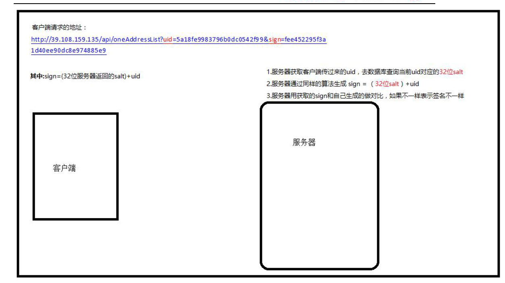

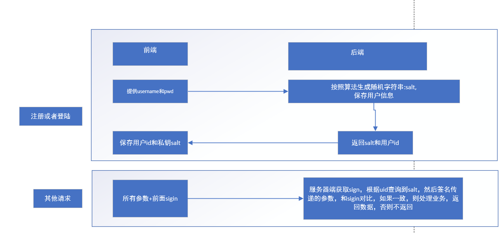

### 20.Angular 路由守卫以及登录权限判断

#### 1、路由守卫

当用户满足一定条件才被允许进入或者离开一个路由。
路由守卫场景：
只有当用户登录并拥有某些权限的时候才能进入某些路由。
一个由多个表单组成的向导，例如注册流程，用户只有在当前路由的组件中填写了满足要求
的信息才可以导航到下一个路由。
当用户未执行保存操作而试图离开当前导航时提醒用户。
Angular 提供了一些钩子帮助控制进入或离开路由。这些钩子就是路由守卫，可以通过这些
钩子实现上面场景。
CanActivate: 处理导航到某路由的情况。
CanDeactivate: 处理从当前路由离开的情况。
Resolve: 在路由激活之前获取路由数据。
详情参考：http://bbs.itying.com/topic/5cd0f7dd344fb3153804ee69

#### 2、CanActivate 判断用户权限

1、创建一个login.guard.ts

```powershell
ionic g guard services/login
```

2、LoginGuard 类实现CanActivate 接口，返回true 或false，Angular 根据返回值判断路由通过或不通过

Guard 顾名思义就是用来保护一个路径。可以用来判断用户只有在满足一定的条件的情况下才能打开这个路径对应的页面.

```typescript
import { CanActivate } from "@angular/router";
export class LoginGuard implements CanActivate{
  canActivate(){
    var userinfo=this.storage.get('userinfo');
    if(!userinfo || !userinfo.username){
      return false;
    }else{
      return true;
    }
  }
}
```

2、路由里面配置路由守卫

canActivate 可以指定多个守卫，值是一个数组。

```typescript
import { LoginGuard } from './services/login.guard';
const routes: Routes = [
  { path: '', loadChildren: './tabs/tabs.module#TabsPageModule' },
  { path: 'search', loadChildren: './search/search.module#SearchPageModule' },
  { path: 'login', loadChildren: './login/login.module#LoginPageModule' },
  { path: 'registerstep1', loadChildren:
      './registerstep1/registerstep1.module#Registerstep1PageModule' },
  { path: 'registerstep2', loadChildren:
      './registerstep2/registerstep2.module#Registerstep2PageModule' },
  { path: 'registerstep3', loadChildren:
      './registerstep3/registerstep3.module#Registerstep3PageModule' },
  { path: 'productlist', loadChildren: './productlist/productlist.module#ProductlistPageModule' },
  { path: 'pcontent', loadChildren: './pcontent/pcontent.module#PcontentPageModule' },
  { path: 'personal', loadChildren: './personal/personal.module#PersonalPageModule' },
  { path: 'cart', loadChildren: './cart/cart.module#CartPageModule' },
  { path: 'checkout', loadChildren: './checkout/checkout.module#CheckoutPageModule' },
  {
    path: 'addressadd',
    loadChildren: './addressadd/addressadd.module#AddressaddPageModule',
    canActivate:[LoginGuard]
  },
  { path: 'addresslist',
    loadChildren: './addresslist/addresslist.module#AddresslistPageModule',
    canActivate:[LoginGuard]
  },
  {
    path: 'addressedit',
    loadChildren: './addressedit/addressedit.module#AddresseditPageModule',
    canActivate:[LoginGuard]
  }
];

```

3、CanDeactivate 、Resolve 守卫

请参考：http://bbs.itying.com/topic/5cd0f7dd344fb3153804ee69

代码地址:

<https://github.com/hufanglei/angular-it-demo/tree/ionic4-53>

### 21.提交订单、去支付页面制作

1、提交订单api 接口

请求方式：post

地址：域名/api/doOrder
传参说明：
参数说明备注
uid  用户id  必传
sign 签名验证地址   是否合法
address 收货地址
phone   电话号码
name   收货人姓名
all_price    总价
products 所有商品数据序列化的集合  此字段不需要参与签名）（JSON.stringify(商品集合)

返回参数：

| 参数    | 说明                | 备注     |
| ------- | ------------------- | -------- |
| success | true/false          | 是否成功 |
| message | 提示信息            |          |
| result  | order_id  all_price |          |

2、选择支付方式

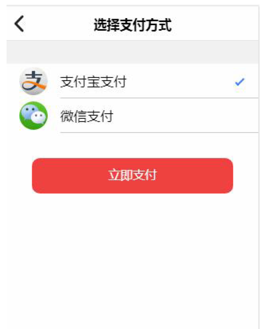

#### 1.解决单选框页面选中有bug的问题思路:

- 查看html源代码，找到2个css item-radio-checked和radio-checked

- 给radio上动态加上那2个样式

  ```html
  <ion-radio-group [(ngModel)]="payType">
                <ion-item class="item-radio-checked">
                  <ion-avatar slot="start">
                    
                  </ion-avatar>
                  <ion-label>支付宝支付</ion-label>    
                   <ion-radio [ngClass]="{'radio-checked': payType==1}" slot="end" value="1"></ion-radio>
                </ion-item>                
                <ion-item>
                    <ion-avatar slot="start">
                      
                    </ion-avatar>
                    <ion-label>微信支付</ion-label>    
                    <ion-radio slot="end" value="2"></ion-radio>
                </ion-item>
          </ion-radio-group>
  ```

  ## 2.js get路由传值

  ```typescript
   if(!this.userinfo){
        this.navController.navigateForward(['/login'],{
          queryParams: { 
            returnUrl: '/checkout' 
          }
        });    
      }else if(!this.addressList){
          alert('您还没有选择收货地址');
      }
  ```

  接收传值

  ```typescript
  this.activatedRoute.queryParams.subscribe((data: any) => {         
        data.returnUrl? this.returnUrl=data.returnUrl:this.returnUrl='/tabs/tab3';   
  })
  ```

  总结:

  - 注意下单的传递参数组装
  - 注意清空购物车的逻辑

代码地址:

<https://github.com/hufanglei/angular-it-demo/tree/ionic4-54>


